# BÁO CÁO DỰ ÁN
# PvP QUIZ GAME — ỨNG DỤNG GAME ĐỐ VUI TRỰC TUYẾN 1 VS 1

> **Môn học:** Thiết kế & Triển khai Hệ thống Phần mềm  
> **Sinh viên:** Nguyễn Thế Chiến  
> **Năm học:** 2025–2026  
> **Nền tảng:** Android | **Engine:** Unity | **Backend:** Firebase

---

# I. MÔ TẢ HỆ THỐNG

## I.1. Mô tả chung về hệ thống và lý do lựa chọn

### Mô tả chung

**PvP Quiz Game** là ứng dụng game trả lời câu hỏi (Quiz) trên nền tảng Android, cho phép hai người chơi đối đầu trực tiếp với nhau theo thời gian thực (Real-time Player vs Player). Người chơi đăng nhập, tìm đối thủ qua hệ thống ghép cặp tự động (Matchmaking), sau đó cùng trả lời một bộ câu hỏi được đồng bộ hóa. Người có tổng điểm cao hơn sau khi kết thúc toàn bộ câu hỏi sẽ giành chiến thắng và nhận phần thưởng (EXP, Tiền ảo).

Ứng dụng hỗ trợ hai chế độ chơi:
- **Chế độ Online (PvP):** Đấu với người thật qua Internet. Điểm số, đáp án và trạng thái trận được đồng bộ real-time thông qua Firebase Realtime Database với độ trễ dưới 200ms.
- **Chế độ Offline (Đấu với máy):** Đấu với AI bot để luyện tập, không yêu cầu kết nối mạng.

Hệ thống được thiết kế với kiến trúc MVC kết hợp Event-Driven, giao diện xây dựng bằng Unity UI Toolkit (UXML/USS), và hỗ trợ đa ngôn ngữ (Tiếng Việt / Tiếng Anh) thông qua Google Sheets.

### Lý do lựa chọn

| Tiêu chí | Lý do |
|---|---|
| **Tính thực tiễn** | Game quiz PvP tích hợp đầy đủ các thành phần của hệ thống phần mềm hoàn chỉnh: xác thực, cơ sở dữ liệu, đồng bộ thời gian thực, giao diện người dùng và hệ thống phần thưởng |
| **Firebase Realtime Database** | Cho phép đồng bộ trạng thái giữa 2 thiết bị với độ trễ < 200ms mà không cần tự xây dựng và vận hành server backend |
| **Unity + UI Toolkit** | Unity hỗ trợ xuất bản đa nền tảng; UI Toolkit (UXML/USS) dựa trên chuẩn web (Flexbox) cho phép thiết kế giao diện linh hoạt, tái sử dụng cao |
| **Hệ thống Localization** | Tích hợp đa ngôn ngữ từ Google Sheets cho phép cập nhật nội dung (câu hỏi, giao diện) mà không cần build lại ứng dụng |
| **Phạm vi phù hợp** | Đủ phức tạp để minh họa các kỹ thuật thiết kế phần mềm (State Machine, Event-Driven, Provider Pattern) nhưng có thể hoàn thành trong giới hạn môn học |

---

## I.2. Khảo sát hệ thống tương tự

Để xác định các tính năng cần thiết và điểm khác biệt, bốn hệ thống phổ biến cùng loại đã được khảo sát:

### Kahoot!

**Mô tả:** Nền tảng quiz giáo dục cho phép giáo viên tạo câu hỏi và học sinh tham gia qua mã phòng (PIN). Hỗ trợ hàng trăm người cùng chơi trong một phiên.

**Điểm mạnh:** Giao diện trực quan, dễ sử dụng cho mọi lứa tuổi; cộng đồng câu hỏi lớn; hỗ trợ nhiều loại câu hỏi (trắc nghiệm, đúng/sai, nhập văn bản); hệ thống điểm kết hợp độ chính xác và tốc độ trả lời.

**Điểm yếu:** Không hỗ trợ trận đấu 1 vs 1 thực sự (tất cả đều chơi cùng lúc trong room chung); người chơi phụ thuộc vào người tổ chức để tạo game; không có hệ thống level/progression.

### Quizizz

**Mô tả:** Tương tự Kahoot! nhưng cho phép người chơi tự làm bài theo tốc độ của mình (self-paced), không bị ràng buộc bởi màn hình chủ.

**Điểm mạnh:** Chế độ tự làm bài linh hoạt; có hệ thống meme feedback hài hước; hỗ trợ làm bài về nhà (homework mode).

**Điểm yếu:** Tương tác PvP trực tiếp yếu; không có matchmaking tự động; thiếu cảm giác cạnh tranh thời gian thực.

### Trivia Crack

**Mô tả:** Game đố vui di động cho phép 2 người chơi đấu với nhau theo lượt (turn-based) với 6 chủ đề khác nhau.

**Điểm mạnh:** Đồ họa sinh động; 6 danh mục câu hỏi phong phú; hệ thống thách đấu bạn bè; cộng đồng câu hỏi do người dùng tạo.

**Điểm yếu:** Chơi theo lượt, không phải real-time (thiếu cảm giác cạnh tranh trực tiếp); phụ thuộc nhiều vào kết nối mạng; nhiều quảng cáo ở phiên bản miễn phí.

### So sánh tổng quan

| Tính năng | Kahoot! | Quizizz | Trivia Crack | **PvP Quiz Game** |
|---|:---:|:---:|:---:|:---:|
| Trận đấu 1 vs 1 thực sự | ✗ | ✗ | ✓ (turn-based) | **✓ (real-time)** |
| Matchmaking tự động | ✗ | ✗ | ✓ | **✓** |
| Đồng bộ điểm real-time | ✗ | ✗ | ✗ | **✓** |
| Hỗ trợ Offline (vs AI) | ✗ | ✓ | ✗ | **✓** |
| Hệ thống Level / EXP | ✗ | ✗ | ✓ | **✓** |
| Đa ngôn ngữ động | ✓ | ✓ | ✓ | **✓** |
| Không cần server riêng | — | — | — | **✓ (Firebase)** |

**Nhận xét:** PvP Quiz Game tập trung vào trải nghiệm đấu 1 vs 1 thời gian thực với matchmaking tự động — điểm mà cả Kahoot! lẫn Quizizz đều thiếu. So với Trivia Crack, hệ thống này có lợi thế đồng bộ real-time (cả 2 cùng trả lời song song thay vì theo lượt) và không yêu cầu hạ tầng server phức tạp nhờ Firebase.

---

# II. THU THẬP YÊU CẦU

## II.1. Bảng thuật ngữ

| Thuật ngữ | Định nghĩa |
|---|---|
| **PvP (Player vs Player)** | Chế độ chơi trong đó 2 người thật đấu trực tiếp với nhau, phân biệt với PvE (vs AI/máy) |
| **Matchmaking** | Thuật toán tự động ghép cặp 2 người chơi có yêu cầu tìm trận vào cùng một phòng đấu |
| **Room (Phòng đấu)** | Node dữ liệu trên Firebase chứa toàn bộ thông tin một trận đấu: seed, state, answers, scores, winner |
| **Seed** | Số nguyên khởi tạo bộ sinh số ngẫu nhiên (RNG). Hai client dùng chung seed cho ra cùng thứ tự câu hỏi sau khi shuffle |
| **Host** | Một trong 2 người chơi được chỉ định làm chủ phòng (UID nhỏ hơn). Host có quyền ghi kết quả cuối trận lên Firebase |
| **Firebase Authentication** | Dịch vụ xác thực của Google Firebase, hỗ trợ đăng nhập Email/Password |
| **Firebase Realtime Database** | Cơ sở dữ liệu NoSQL dạng JSON của Firebase, đồng bộ dữ liệu real-time tới tất cả client đang lắng nghe |
| **Firebase Remote Config** | Dịch vụ Firebase cho phép thay đổi tham số cấu hình (thời gian đếm ngược, số câu) mà không cần cập nhật app |
| **UI Toolkit (UXML/USS)** | Framework xây dựng giao diện của Unity dựa trên chuẩn XML/CSS, hỗ trợ Flexbox layout |
| **Localization** | Quá trình điều chỉnh nội dung ứng dụng phù hợp với ngôn ngữ và văn hóa từng vùng địa lý |
| **PlayerPrefs** | API của Unity để lưu trữ dữ liệu key-value đơn giản trên thiết bị cục bộ |
| **Singleton** | Mẫu thiết kế đảm bảo một lớp chỉ có duy nhất một instance trong toàn ứng dụng |
| **Event-Driven Architecture** | Kiến trúc các thành phần giao tiếp qua sự kiện (event) thay vì gọi trực tiếp, giảm sự phụ thuộc giữa module |
| **State Machine** | Mô hình trong đó đối tượng có thể ở một trong các trạng thái xác định và chuyển đổi theo quy tắc (Idle → Countdown → Playing → GameOver) |
| **ScriptableObject** | Kiểu asset của Unity dùng lưu trữ dữ liệu độc lập với Scene (PlayerData, QuizDatabase) |
| **EXP (Experience Points)** | Điểm kinh nghiệm tích lũy sau mỗi trận, dùng để tăng cấp độ (Level) người chơi |
| **WinResult** | Enum kết quả trận đấu: `Player1Wins`, `Player2Wins`, `Draw` |
| **ForcedSurrender** | Cơ chế xử thua cưỡng bức khi người chơi thoát giữa trận hoặc đối thủ mất kết nối |
| **Tier** | Nhóm phân loại Level người chơi (Beginner/Intermediate/Advanced) xác định số câu hỏi trong trận Offline |
| **RevealDuration** | Khoảng thời gian (2.5 giây) hiển thị feedback đúng/sai sau mỗi câu trước khi chuyển sang câu tiếp theo |

---

## II.2. Mô hình nghiệp vụ

### II.2.1. Mục tiêu và phạm vi hệ thống

**Mục tiêu hệ thống:**

PvP Quiz Game được xây dựng nhằm cung cấp trải nghiệm thi đố kiến thức có tính cạnh tranh cao giữa 2 người chơi theo thời gian thực, đồng thời hỗ trợ học tập/luyện tập cá nhân qua chế độ đấu với máy. Hệ thống hướng đến các mục tiêu cụ thể sau:

- **Tạo sân chơi cạnh tranh lành mạnh:** Mỗi trận đấu diễn ra với bộ câu hỏi đồng bộ (cùng seed), đảm bảo tính công bằng tuyệt đối giữa hai người chơi.
- **Thúc đẩy học tập qua gamification:** Hệ thống Level, EXP, Tiền ảo và phần thưởng sau mỗi trận tạo động lực cho người chơi tiếp tục tham gia.
- **Phá bỏ rào cản ngôn ngữ:** Hỗ trợ đa ngôn ngữ (Tiếng Việt, Tiếng Anh) với nội dung câu hỏi có thể cập nhật từ xa qua Google Sheets.
- **Dễ tiếp cận:** Người dùng không có tài khoản vẫn có thể trải nghiệm game ngay qua chế độ Khách (Guest).

**Phạm vi hệ thống:**

| Trong phạm vi (In-scope) | Ngoài phạm vi (Out-of-scope) |
|---|---|
| Đăng ký / Đăng nhập / Đăng xuất (Email & Password) | Chat trong trận đấu |
| Chơi khách (Guest) — lưu dữ liệu cục bộ | Hệ thống bạn bè / lời mời đấu trực tiếp |
| Tìm trận & ghép cặp tự động (Matchmaking) | Cửa hàng / nạp tiền thật |
| Trận PvP trực tuyến đồng bộ real-time | Chức năng quản trị câu hỏi (Admin Panel) |
| Trận Offline với AI bot | Bảng xếp hạng toàn cầu (Leaderboard) |
| Hồ sơ người chơi: Tên, Avatar (1/8), Level, EXP, Tiền | Hỗ trợ iOS hoặc PC |
| Cài đặt Âm thanh, Đa ngôn ngữ | Đăng nhập bằng mạng xã hội (Google, Facebook) |
| Thoát giữa trận với xử phạt (thua) | Lưu lịch sử trận đấu |

### II.2.2. Mô tả chức năng từng người dùng

Hệ thống có 2 loại người dùng chính:

#### Người chơi đã đăng nhập (Authenticated Player)

Người dùng đã tạo tài khoản Firebase bằng Email/Password. Dữ liệu hồ sơ (Level, EXP, Tiền) được đồng bộ lên Cloud sau mỗi trận.

**Các chức năng có thể thực hiện:**

**1. Quản lý tài khoản:**
- *Đăng ký:* Cung cấp Tên hiển thị, Email, Mật khẩu → Hệ thống tạo tài khoản Firebase Auth và khởi tạo bản ghi dữ liệu mặc định (Level 1, 0 EXP, 0 tiền) trên Realtime Database.
- *Đăng nhập:* Nhập Email + Mật khẩu → Firebase xác thực → Tải dữ liệu Profile từ Cloud về thiết bị.
- *Đăng xuất:* Xóa session hiện tại, chuyển về màn hình Init.

**2. Quản lý hồ sơ:**
- *Chỉnh sửa hồ sơ:* Thay đổi Tên hiển thị và lựa chọn 1 trong 8 Avatar. Lưu thay đổi → cập nhật giao diện ngay lập tức và đồng bộ lên Firebase.

**3. Tìm trận đấu PvP Online:**
- *Tìm trận:* Hệ thống ghi UID vào hàng chờ Firebase (matchmakingQueue). Nếu đã có người chờ → tham gia phòng đó; nếu chưa → tạo phòng mới với seed ngẫu nhiên. Khi đủ 2 người → cả 2 tự động chuyển vào trận.
- *Hủy tìm trận:* Xóa khỏi hàng chờ, về màn hình chính.

**4. Tham gia trận đấu:**
- *Bắt đầu trận:* Sau countdown 3-2-1, bộ câu hỏi được load (10 câu, đồng bộ seed). Người chơi chọn đáp án trong thời gian đếm ngược; hết giờ coi như sai. Điểm đối thủ cập nhật real-time.
- *Đầu hàng:* Bấm ✖ → xác nhận → bị xử thua ngay, đối thủ thắng.
- *Xem kết quả:* Sau trận xem Thắng/Thua/Hòa, điểm số hai bên, phần thưởng nhận được.

**5. Luyện tập:**
- *Chơi với máy:* Đấu với AI bot Offline, không cần mạng. Số câu hỏi điều chỉnh theo Level.

**6. Cài đặt:**
- *Đổi ngôn ngữ:* Chuyển giữa Tiếng Việt và Tiếng Anh, toàn bộ giao diện và câu hỏi cập nhật ngay lập tức.
- *Âm thanh:* Bật/tắt Music nền và hiệu ứng âm thanh (SFX) độc lập.

#### Người chơi khách (Guest Player)

Người dùng chưa có tài khoản, chỉ nhập Tên hiển thị. Dữ liệu chỉ lưu cục bộ (PlayerPrefs).

**Được phép:**
- Chơi với máy (Offline)
- Đổi ngôn ngữ, cài đặt âm thanh
- Nhận phần thưởng (lưu cục bộ)

**Không được phép:**
- Tìm trận đấu PvP Online (yêu cầu xác thực Firebase)
- Đồng bộ dữ liệu lên Cloud

**Lưu ý khi đăng xuất:** Hệ thống hiển thị cảnh báo *"Đăng xuất sẽ làm mất toàn bộ dữ liệu cục bộ"* trước khi xác nhận.

### II.2.3. Biểu đồ Use Case của hệ thống

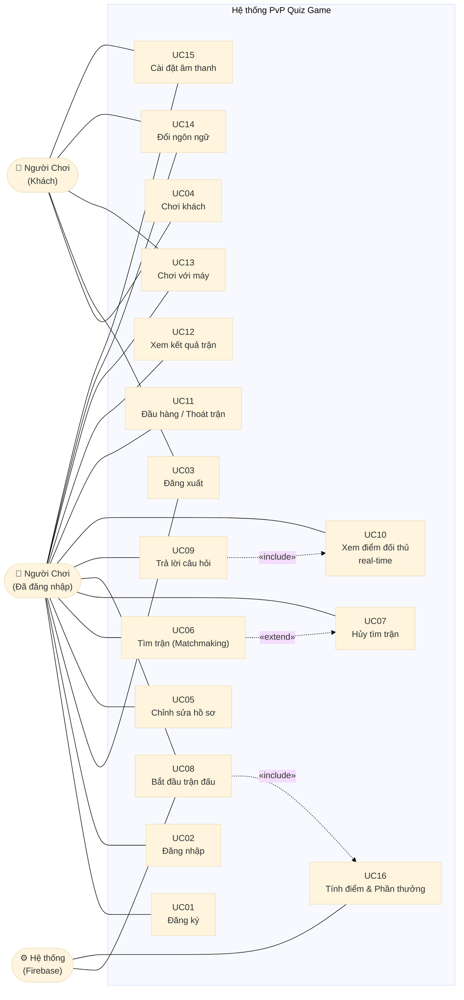

*Lưu ý: Hệ thống có 2 actor người dùng (Người chơi đã đăng nhập và Khách) và 1 actor hệ thống (Firebase). Chức năng Admin Panel đã bị loại bỏ khỏi phạm vi.*

---

## II.3. Bảng yêu cầu người dùng

### Yêu cầu chức năng (Functional Requirements)

| Mã | Yêu cầu | UC | Ưu tiên |
|---|---|:---:|:---:|
| FR-01 | Hệ thống cho phép người dùng đăng ký tài khoản bằng Tên hiển thị, Email và Mật khẩu | UC01 | Must |
| FR-02 | Hệ thống xác thực đăng nhập bằng Email/Password qua Firebase Authentication | UC02 | Must |
| FR-03 | Hệ thống cho phép đăng xuất và xóa session hiện tại trên thiết bị | UC03 | Must |
| FR-04 | Người dùng có thể trải nghiệm game không cần tài khoản (chế độ Khách), dữ liệu lưu cục bộ | UC04 | Must |
| FR-05 | Người chơi đã đăng nhập có thể thay đổi Tên hiển thị và Avatar (1 trong 8 lựa chọn); thay đổi đồng bộ lên Firebase | UC05 | Should |
| FR-06 | Hệ thống tự động ghép cặp 2 người chơi có yêu cầu tìm trận qua Firebase Matchmaking Queue | UC06 | Must |
| FR-07 | Người chơi có thể hủy tìm trận bất kỳ lúc nào và trở về màn hình chính | UC07 | Must |
| FR-08 | Hệ thống đồng bộ seed câu hỏi và số câu cho cả 2 client từ Firebase room, đảm bảo cùng bộ câu hỏi | UC08 | Must |
| FR-09 | Người chơi chọn đáp án trong thời gian đếm ngược; hết giờ không chọn được tính là sai | UC09 | Must |
| FR-10 | Điểm số của đối thủ được cập nhật real-time trên HUD trong thời gian < 200ms | UC10 | Must |
| FR-11 | Người chơi có thể thoát giữa trận sau khi xác nhận; bị xử thua ngay lập tức, đối thủ thắng | UC11 | Must |
| FR-12 | Sau khi kết thúc trận, hệ thống hiển thị kết quả (Thắng/Thua/Hòa), điểm 2 bên và phần thưởng | UC12 | Must |
| FR-13 | Người chơi có thể đấu với AI bot Offline mà không cần kết nối mạng | UC13 | Must |
| FR-14 | Người dùng có thể đổi ngôn ngữ giao diện (Tiếng Việt / English); toàn bộ text cập nhật ngay | UC14 | Must |
| FR-15 | Người dùng có thể bật/tắt âm nhạc nền và hiệu ứng âm thanh độc lập nhau | UC15 | Should |
| FR-16 | Hệ thống tự động trao EXP và Tiền ảo dựa theo kết quả trận (Thắng/Hòa/Thua) | UC16 | Must |
| FR-17 | Dữ liệu hồ sơ (Level, EXP, Tiền) tự động đồng bộ lên Firebase sau mỗi trận (với tài khoản đã đăng nhập) | UC16 | Must |
| FR-18 | Hệ thống Localization tải câu hỏi/giao diện từ Google Sheets; tự động fallback sang cache hoặc JSON local khi offline | — | Should |

### Yêu cầu phi chức năng (Non-Functional Requirements)

| Mã | Loại | Yêu cầu |
|---|---|---|
| NFR-01 | **Hiệu năng** | Đồng bộ điểm số và trạng thái giữa 2 thiết bị trong < 200ms (Firebase Realtime Database) |
| NFR-02 | **Hiệu năng** | Ứng dụng duy trì 60 FPS trên thiết bị Android tầm trung (API 23+, RAM 2GB) |
| NFR-03 | **Độ tin cậy** | Nếu đối thủ mất kết nối giữa trận, hệ thống phát hiện trong ≤ 5 giây và tự động xử lý thắng/thua |
| NFR-04 | **Độ tin cậy** | Hệ thống Localization có fallback 3 cấp (Sheet → Cache → Local JSON) đảm bảo game không crash khi offline |
| NFR-05 | **Bảo mật** | Mật khẩu người dùng được mã hóa bởi Firebase Authentication; không lưu plain-text trên thiết bị |
| NFR-06 | **Bảo mật** | Firebase Security Rules đảm bảo người dùng chỉ được ghi vào node dữ liệu của chính mình |
| NFR-07 | **Khả dụng** | Giao diện hỗ trợ cả màn hình ngang và dọc thông qua UI Toolkit Flexbox layout |
| NFR-08 | **Khả năng bảo trì** | Kiến trúc Event-Driven (C# Action/Delegate) tách biệt hoàn toàn tầng UI và Logic, không tạo Circular Dependency |
| NFR-09 | **Khả năng mở rộng** | Bộ câu hỏi được cập nhật từ xa qua Google Sheets mà không cần rebuild hoặc cập nhật ứng dụng |
| NFR-10 | **Tính nhất quán** | Cả 2 client trong cùng phòng luôn dùng chung seed → cùng bộ câu hỏi và thứ tự shuffle |

---

# III. PHÂN TÍCH

## III.1. UC Specification — Các UC quan trọng

### UC06 — Tìm trận đấu (Matchmaking)

| Trường | Nội dung |
|---|---|
| **Mã UC** | UC06 |
| **Tên** | Tìm trận đấu (Matchmaking) |
| **Actor chính** | Người chơi đã đăng nhập |
| **Actor phụ** | Hệ thống Firebase |
| **Mô tả** | Người chơi kích hoạt tìm đối thủ. Hệ thống tự động ghép cặp qua Firebase và chuyển cả 2 vào trận khi đủ người. |
| **Tiền điều kiện** | Người chơi đang ở HomeScene, đã xác thực Firebase, có kết nối mạng |
| **Hậu điều kiện — Thành công** | Phòng đấu được tạo trên Firebase; cả 2 người chuyển vào GameplayScene |
| **Hậu điều kiện — Thất bại** | Người chơi ở lại HomeScene, không có phòng nào được tạo |

**Luồng chính (Main Flow):**

| Bước | Actor | Hành động |
|:---:|---|---|
| 1 | Người chơi | Nhấn nút "TÌM TRẬN ĐẤU" |
| 2 | Hệ thống | Giao diện chuyển sang "Đang tìm đối thủ..." |
| 3 | Hệ thống | `FirebaseManager` ghi UID vào `matchmakingQueue/{uid}` |
| 4 | Firebase | Kiểm tra hàng chờ: nếu rỗng → tạo phòng mới với seed ngẫu nhiên; nếu có người → tham gia phòng đó |
| 5 | Firebase | Khi `rooms/{id}/players` đủ 2 người: fire `OnMatchFound` |
| 6 | Hệ thống | Cả 2 client nhận event → chuyển sang GameplayScene |

**Luồng thay thế (Alternative Flows):**

- **4a — Hủy tìm kiếm (UC07):** Người chơi nhấn "Hủy" → Xóa UID khỏi `matchmakingQueue` → Về HomeScene.
- **4b — Mất kết nối:** Firebase timeout → Thông báo lỗi → Về HomeScene.
- **5a — Đối thủ ngắt kết nối ngay sau ghép:** `OnOpponentDisconnected` → Xử thắng cho người ở lại, về HomeScene.

---

### UC08 — Bắt đầu trận đấu

| Trường | Nội dung |
|---|---|
| **Mã UC** | UC08 |
| **Tên** | Bắt đầu trận đấu |
| **Actor chính** | Hệ thống (tự động) |
| **Mô tả** | Sau khi vào GameplayScene, hệ thống khởi tạo trận: đồng bộ seed (Online) hoặc sinh seed ngẫu nhiên (Offline), countdown và bắt đầu vòng lặp câu hỏi. |
| **Tiền điều kiện** | Đã vào GameplayScene; Online: có `CurrentRoomId` hợp lệ |
| **Hậu điều kiện** | `GameState = Playing`, câu hỏi đầu tiên hiển thị, timer đang chạy |

**Luồng chính:**

| Bước | Actor | Hành động |
|:---:|---|---|
| 1 | Hệ thống | `GameController.Start()` xác định mode (Online/Offline) dựa vào trạng thái `FirebaseManager` |
| 2 | Hệ thống | `ChangeState(Countdown)` → Hiển thị 3 → 2 → 1 (mỗi giây) |
| 3 | Hệ thống | `ChangeState(Playing)` |
| 4 | Hệ thống (Online) | Đọc `seed` và `questionCount` từ `rooms/{id}` — đồng bộ 2 client dùng chung giá trị |
| 4 | Hệ thống (Offline) | Sinh `seed` từ `DateTime.UtcNow.Ticks`; tính `questionCount` theo Tier Level |
| 5 | Hệ thống | `QuizManager.StartQuiz(seed, questionCount)` → Fisher-Yates shuffle |
| 6 | Hệ thống | `TimerController.StartTimer()` → Bắt đầu đếm ngược câu 1 |

---

### UC09 — Trả lời câu hỏi

| Trường | Nội dung |
|---|---|
| **Mã UC** | UC09 |
| **Tên** | Trả lời câu hỏi |
| **Actor chính** | Người chơi |
| **Actor phụ** | Hệ thống Firebase (Online) |
| **Mô tả** | Trong trận, người chơi chọn 1 trong 4 đáp án trước khi hết giờ. Hệ thống kiểm tra, hiển thị feedback, cập nhật điểm và chuyển câu tiếp. |
| **Tiền điều kiện** | `GameState = Playing`; có câu hỏi hiện tại; `TimerController` đang chạy |
| **Hậu điều kiện — Đúng** | `+10 điểm`, feedback xanh, điểm đẩy lên Firebase (Online) |
| **Hậu điều kiện — Sai/Hết giờ** | `+0 điểm`, feedback đỏ, chuyển câu tiếp |

**Luồng chính:**

| Bước | Actor | Hành động |
|:---:|---|---|
| 1 | Hệ thống | Hiển thị câu hỏi, 4 nút đáp án (A/B/C/D), bộ đếm ngược |
| 2 | Người chơi | Chạm vào 1 nút đáp án |
| 3 | Hệ thống | `InputController.SetLocalAnswer(index)` → `GameController` lưu lại |
| 4 | Hệ thống (Online) | `FirebaseMatchProvider` ghi đáp án lên `rooms/{id}/answers/{uid}` |
| 5 | Hệ thống | Chờ `TimerController.OnTimerEnd` |
| 6 | Hệ thống | `ScoreManager.CheckAnswer(1, index)`: Đúng → +10 điểm; Sai → +0 |
| 7 | Hệ thống (Online) | `FirebaseManager.UpdateMyScore(score)` → push điểm lên Firebase |
| 8 | Hệ thống | `InputController.ShowAnswerFeedback()`: đúng = xanh, sai = đỏ (2.5 giây) |
| 9 | Hệ thống | Nếu còn câu → `NextQuestion()` + `StartTimer()`; nếu hết → `ChangeState(GameOver)` |

**Luồng thay thế:**
- **2a — Không chọn đáp án:** Hết giờ với `answerIndex = -1` → `CheckAnswer(1, -1)` → Sai → +0 điểm.
- **4a — Đối thủ ngắt kết nối:** `OnOpponentDisconnected` → `ForcedSurrender(P2)` → GameOver ngay.

---

### UC11 — Đầu hàng / Thoát giữa trận

| Trường | Nội dung |
|---|---|
| **Mã UC** | UC11 |
| **Tên** | Đầu hàng / Thoát giữa trận |
| **Actor chính** | Người chơi |
| **Mô tả** | Người chơi muốn rời trận đang diễn ra. Hệ thống cảnh báo hậu quả; nếu xác nhận, người chơi thua và đối thủ thắng. |
| **Tiền điều kiện** | `GameState = Playing` |
| **Hậu điều kiện — Xác nhận** | P1 thua, P2 thắng; Online: Firebase cập nhật `winner`; chuyển sang GameOver |
| **Hậu điều kiện — Hủy** | Trận tiếp tục bình thường |

**Luồng chính:**

| Bước | Actor | Hành động |
|:---:|---|---|
| 1 | Người chơi | Nhấn nút ✖ ở góc trên trái |
| 2 | Hệ thống | Mở Exit Confirm Popup: *"Bạn có chắc muốn rời đi? Bạn sẽ bị xử thua"* |
| 3 | Người chơi | Nhấn "Xác nhận rời" |
| 4 | Hệ thống | `GameController.ForcedSurrender()` → `ScoreManager.SetForcedWinner(Player2Wins)` |
| 5 | Hệ thống | `ChangeState(GameOver)` |
| 6 | Hệ thống (Online) | `HostEndMatch(winner = OpponentId)` → Cập nhật Firebase |
| 7 | Hệ thống | Hiển thị Result Popup (THUA!) |

**Luồng thay thế:**
- **3a — Hủy:** Đóng popup, trận tiếp tục.

---

### UC16 — Tính điểm & Trao phần thưởng

| Trường | Nội dung |
|---|---|
| **Mã UC** | UC16 |
| **Tên** | Tính điểm & Trao phần thưởng |
| **Actor chính** | Hệ thống (tự động) |
| **Mô tả** | Sau khi trận kết thúc, hệ thống xác định thắng/thua/hòa, trao EXP và Tiền ảo, cập nhật Level và lưu dữ liệu. |
| **Tiền điều kiện** | `GameState` vừa chuyển sang `GameOver` |
| **Hậu điều kiện** | `PlayerData` cập nhật EXP, Money, Level; Online: đồng bộ lên Firebase |

**Luồng chính:**

| Bước | Actor | Hành động |
|:---:|---|---|
| 1 | Hệ thống | `GameController.EndMatchRoutine()` được kích hoạt |
| 2 | Hệ thống (Online + Host) | Ghi `winner` và `state = "ended"` vào `rooms/{id}` trên Firebase |
| 3 | Hệ thống | `ScoreManager.AwardRewards()`: xác định `WinResult`, tính EXP và Money |
| 4 | Hệ thống | `PlayerData.AddExp()` → kiểm tra và nâng Level nếu đủ ngưỡng |
| 5 | Hệ thống | `PlayerData.AddMoney()` |
| 6 | Hệ thống | `PlayerDataManager.SaveData()` → lưu vào `PlayerPrefs` |
| 7 | Hệ thống (Online) | `FirebaseManager.SaveProfileToCloud()` → đẩy level, exp, money lên `users/{uid}` |
| 8 | Hệ thống | Fire `OnGameOver` → `GameplayUIController` hiển thị Result Popup |

---

## III.2. Sơ đồ lớp phân tích

Sơ đồ lớp phân tích tập trung vào các lớp nghiệp vụ chính, thể hiện quan hệ và trách nhiệm ở mức khái niệm (không đi sâu vào chi tiết kỹ thuật):

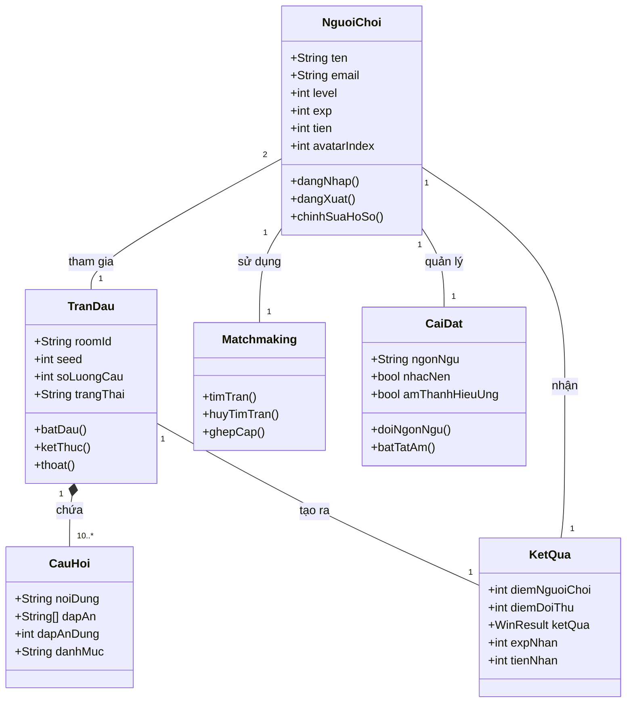

---

## III.3. Mô hình động

### III.3.1. Sequence Diagram — UC06: Tìm trận đấu

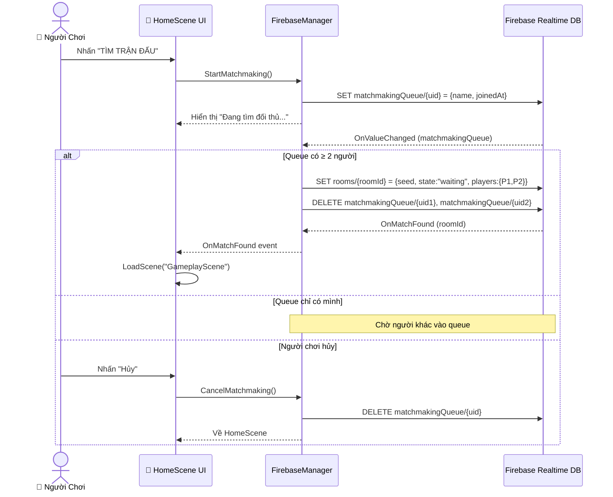

### III.3.2. Sequence Diagram — UC09: Trả lời câu hỏi (Online)

```mermaid
sequenceDiagram
    actor P1 as 👤 Người Chơi (P1)
    actor P2 as 👥 Đối Thủ (P2)
    participant IC as InputController
    participant GC as GameController
    participant TC as TimerController
    participant SM as ScoreManager
    participant FMP as FirebaseMatchProvider
    participant DB as Firebase DB

    Note over P1,DB: GameState = Playing, câu hỏi đang hiển thị

    TC->>GC: OnTimerEnd (đếm ngược bắt đầu)
    P1->>IC: Chạm đáp án [index]
    IC->>GC: SetLocalAnswer(index)
    GC->>FMP: (Online) SubmitAnswer(index)
    FMP->>DB: SET rooms/{id}/answers/{uid_P1} = index

    P2->>DB: SET rooms/{id}/answers/{uid_P2} = index2
    DB-->>FMP: OnValueChanged (cả 2 đã trả lời)
    FMP-->>GC: OnBothPlayersAnswered(p1Ans, p2Ans)

    Note over GC: Hết giờ / cả 2 đã trả lời

    GC->>SM: CheckAnswer(1, p1Answer)
    SM->>SM: Đúng? → +10đ; Sai? → +0đ
    SM->>DB: UpdateMyScore(P1Score) [nếu Online]
    DB-->>SM: OnOpponentScoreUpdated(P2Score)
    SM-->>IC: OnScoreChanged → Cập nhật HUD

    GC->>IC: ShowAnswerFeedback(correctIdx)
    IC-->>P1: Highlight đúng=xanh / sai=đỏ (2.5s)

    alt Còn câu hỏi
        GC->>GC: NextQuestion() + StartTimer()
    else Hết câu hỏi
        GC->>GC: ChangeState(GameOver)
    end
```

### III.3.3. Sequence Diagram — UC16: Tính điểm & Phần thưởng

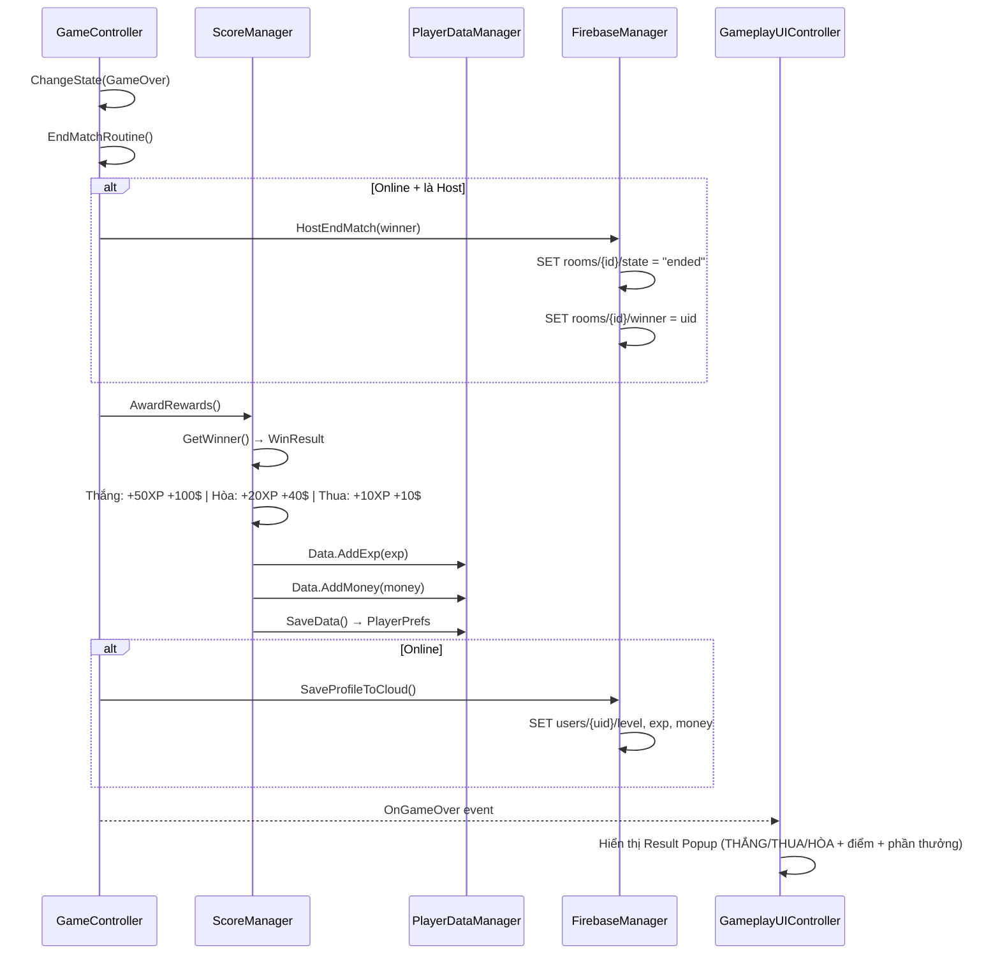

### III.3.4. Activity Diagram — Luồng Matchmaking

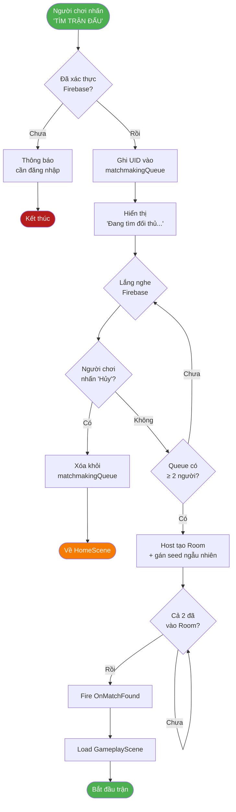

### III.3.5. Activity Diagram — Vòng lặp câu hỏi trong trận

```mermaid
flowchart TD
    A([Bắt đầu trận\nGameState=Playing]) --> B[Load câu hỏi theo seed]
    B --> C[Hiển thị câu hỏi\n+ 4 đáp án + Timer]
    C --> D{Người chơi\nchọn đáp án?}

    D -- Có --> E[Ghi nhận answerIndex\nFirebase: ghi đáp án]
    D -- Hết giờ --> F[answerIndex = -1\nCoi như Sai]

    E --> G[Hết giờ\nTimerController.OnTimerEnd]
    F --> G

    G --> H[CheckAnswer\nĐúng: +10đ | Sai: +0đ]
    H --> I[Firebase: UpdateMyScore\nHUD: Cập nhật điểm 2 bên]
    I --> J[ShowAnswerFeedback\n2.5 giây]
    J --> K{Còn câu\nhỏi?}

    K -- Có --> C
    K -- Không --> L[ChangeState\nGameOver]
    L --> M([Chuyển sang\nTính điểm & Kết quả])

    style A fill:#4CAF50,color:#fff
    style M fill:#4CAF50,color:#fff
    style L fill:#1565C0,color:#fff
```

### III.3.6. Statechart Diagram — GameController

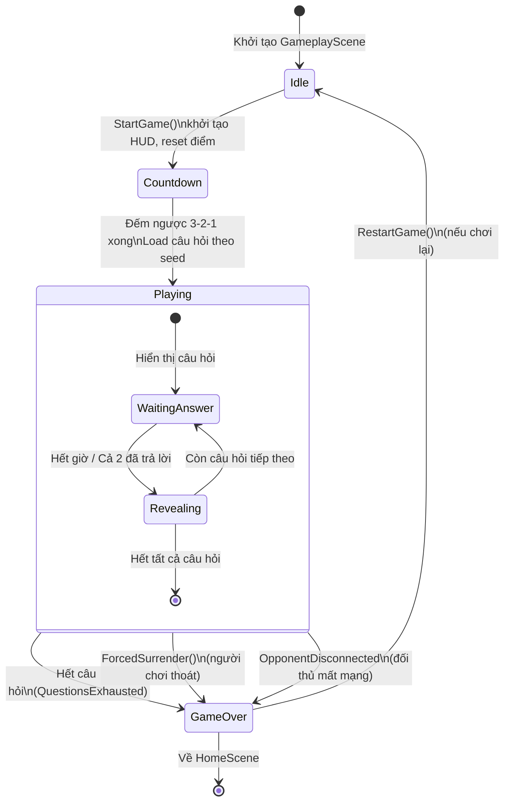

---

# IV. XÂY DỰNG MỚI

## IV.1. Architectural Design

### IV.1.1. Lựa chọn kiến trúc triển khai

Dự án áp dụng **kiến trúc MVC (Model-View-Controller)** kết hợp với hai pattern bổ trợ:

**1. MVC Pattern:**
- **Model:** Các lớp dữ liệu và logic nghiệp vụ (`PlayerData`, `QuestionData`, `ScoreManager`, `QuizManager`). Không phụ thuộc vào Unity UI.
- **View:** Các lớp UI Controller (`InitSceneController_UXML`, `MainMenuUIController_UXML`, `GameplayUIController_UXML`). Chỉ nhận dữ liệu qua event, không gọi trực tiếp Model.
- **Controller:** `GameController` (State Machine điều phối trận đấu), `TimerController`, `InputController_UXML`. Nhận input từ View, cập nhật Model và thông báo lại View qua event.

**2. Singleton Pattern:** Áp dụng cho tất cả Manager (`GameManager`, `FirebaseManager`, `LocalizationManager`, `ScoreManager`, v.v.) để đảm bảo truy cập toàn cục và tồn tại xuyên scene (`DontDestroyOnLoad`).

**3. Event-Driven Architecture (Observer Pattern):** Giao tiếp giữa các thành phần thông qua `C# static event (Action / Delegate)` thay vì gọi trực tiếp. Lợi ích: loại bỏ Circular Dependency, dễ mở rộng và kiểm thử.

**Ví dụ luồng sự kiện:**
```
FirebaseManager.OnMatchFound
    → FirebaseMatchProvider: AttachRoomListeners()
    
FirebaseMatchProvider.OnBothPlayersAnswered
    → GameController: RevealAndAdvance()
    
ScoreManager.OnScoreChanged
    → GameplayUIController: UpdateScoreHUD()
    
LocalizationManager.OnLanguageChanged
    → Tất cả UIController: RefreshAllText()
```

**4. Provider Pattern cho PvP:** `IMatchProvider` interface với 2 implementation:
- `FirebaseMatchProvider` — đồng bộ đáp án và điểm qua Firebase (Online)
- `LocalMatchProvider` + `MockOpponent` — mô phỏng đối thủ cục bộ (Offline)

Lựa chọn provider được thực hiện tự động trong `GameController.Start()` dựa trên trạng thái kết nối.

### IV.1.2. Component / Package Diagram

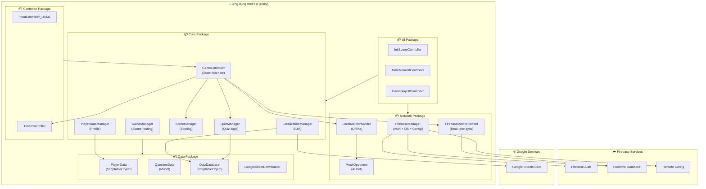

### IV.1.3. Deployment Diagram

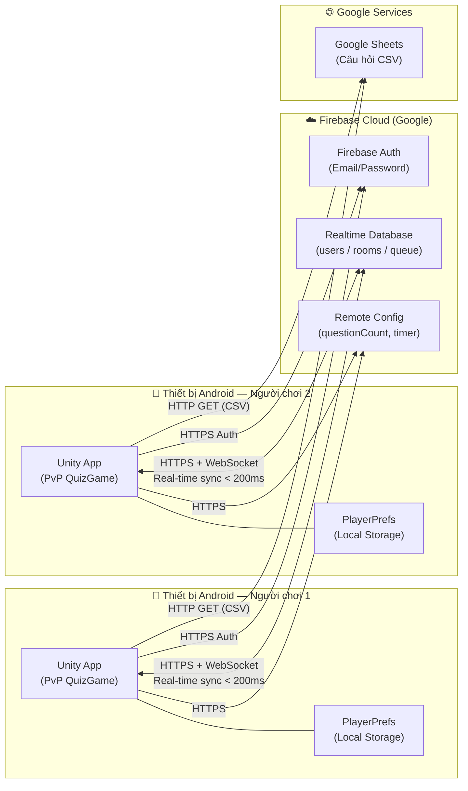

**Cấu hình triển khai:**
- **Client:** Android APK, Min SDK 23 (Android 6.0), Target SDK 34
- **Firebase Project:** Khu vực `asia-southeast1` (Singapore, gần VN nhất)
- **Firebase Realtime Database:** Chế độ locked rules (xác thực bắt buộc)
- **Google Sheets:** Publish to Web dạng CSV, public read

---

## IV.2. Detailed Design

### IV.2.1. Detailed Class Diagram

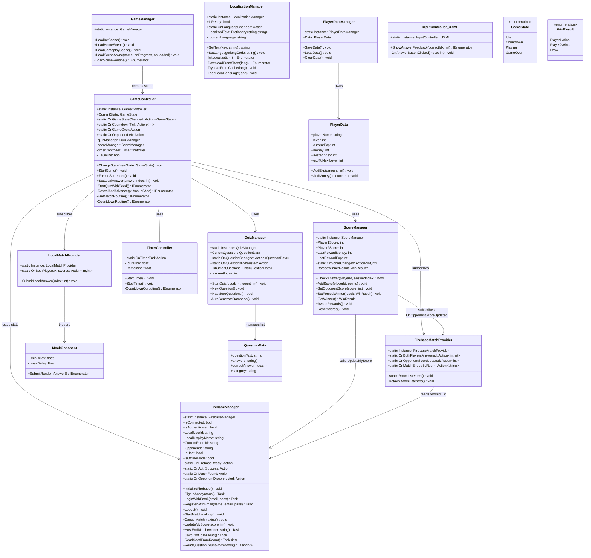

### IV.2.2. Detailed Sequence Diagram — Luồng khởi động & Đăng nhập

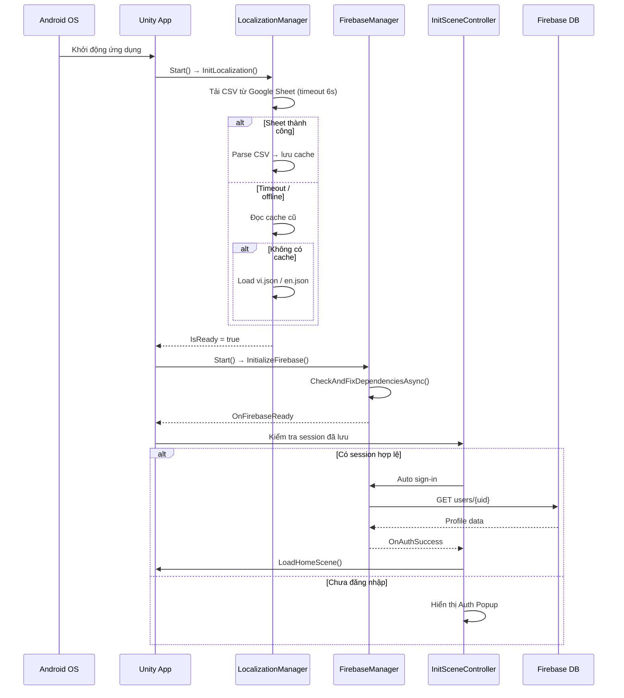

### IV.2.3. ERD — Mô hình dữ liệu Firebase

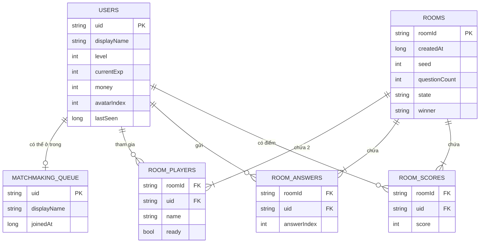

**Firebase JSON Schema thực tế:**
```json
{
  "users": {
    "<uid>": {
      "displayName": "ChienK20",
      "level": 5,
      "currentExp": 120,
      "money": 1250,
      "avatarIndex": 2,
      "lastSeen": 1746012345
    }
  },
  "matchmakingQueue": {
    "<uid>": { "displayName": "ChienK20", "joinedAt": 1746012345 }
  },
  "rooms": {
    "<roomId>": {
      "createdAt": 1746012345,
      "seed": 481923572,
      "questionCount": 10,
      "state": "playing",
      "players": {
        "<uid_P1>": { "name": "ChienK20", "ready": true },
        "<uid_P2>": { "name": "Mai99", "ready": true }
      },
      "answers": { "<uid_P1>": 2, "<uid_P2>": 0 },
      "scores": { "<uid_P1>": 30, "<uid_P2>": 20 },
      "winner": null
    }
  }
}
```

### IV.2.4. UI Design

Giao diện được xây dựng hoàn toàn bằng Unity UI Toolkit (UXML/USS), bố cục Flexbox hỗ trợ cả portrait và landscape.

**InitScene — Màn hình khởi động & Đăng nhập:**
- Loading bar hiển thị tiến trình tải Localization + Firebase
- Auth Popup với 3 tab: Đăng nhập / Đăng ký / Chơi khách

**HomeScene — Sảnh chờ chính:**
- Profile HUD (góc trên trái): Avatar + Tên + Tiền + Level
- 3 nút điều hướng chính: TÌM TRẬN ĐẤU, ĐẤU VỚI MÁY, BẢNG XẾP HẠNG
- Settings button (⚙️ góc trên phải): Popup âm thanh + ngôn ngữ + đăng xuất

**GameplayScene — Màn hình trận đấu:**
- HUD trên cùng: P1 (trái) vs P2 (phải) với Avatar + Tên + Điểm
- Trung tâm: Câu hỏi lớn + Bộ đếm ngược + Chỉ số câu (VD: 3/10)
- Dưới: 4 nút đáp án (A/B/C/D) đổi màu sau khi trả lời
- Overlay: Exit Confirm Popup, Result Popup (THẮNG/THUA/HÒA)

### IV.2.5. Test Case Specification

| Mã TC | UC | Mô tả | Input | Expected Output | Kết quả |
|---|:---:|---|---|---|:---:|
| TC-01 | UC02 | Đăng nhập thành công | Email hợp lệ + Password đúng | Vào HomeScene, Profile hiển thị đúng | Pass |
| TC-02 | UC02 | Đăng nhập sai mật khẩu | Email hợp lệ + Password sai | Thông báo lỗi, ở lại Auth Popup | Pass |
| TC-03 | UC01 | Đăng ký email đã tồn tại | Email đã đăng ký | Thông báo "Email đã tồn tại" | Pass |
| TC-04 | UC06 | Tìm trận — ghép thành công | 2 người cùng nhấn Tìm trận | Cả 2 vào GameplayScene, cùng seed | Pass |
| TC-05 | UC06 | Tìm trận — hủy | Nhấn Hủy khi đang chờ | Về HomeScene, xóa khỏi queue | Pass |
| TC-06 | UC09 | Trả lời đúng | Chọn đáp án đúng (index = correctAnswerIndex) | +10 điểm, nút xanh | Pass |
| TC-07 | UC09 | Trả lời sai | Chọn đáp án sai | +0 điểm, nút đỏ, hiện đáp án đúng | Pass |
| TC-08 | UC09 | Hết giờ không chọn | Không tương tác, đợi hết timer | +0 điểm, chuyển câu tiếp | Pass |
| TC-09 | UC10 | Đồng bộ điểm đối thủ | P2 trả lời đúng (Online) | HUD P2 cập nhật điểm trong < 200ms | Pass |
| TC-10 | UC11 | Đầu hàng | Nhấn ✖ → Xác nhận | Thua ngay, Result Popup hiển thị THUA | Pass |
| TC-11 | UC11 | Hủy đầu hàng | Nhấn ✖ → Hủy | Trận tiếp tục bình thường | Pass |
| TC-12 | UC16 | Phần thưởng khi thắng | P1Score > P2Score khi GameOver | +50 EXP, +100$, lưu lên Firebase | Pass |
| TC-13 | UC16 | Phần thưởng khi thua | P1Score < P2Score khi GameOver | +10 EXP, +10$, lưu lên Firebase | Pass |
| TC-14 | UC14 | Đổi ngôn ngữ sang English | Chọn "English" trong Settings | Toàn bộ text UI chuyển sang tiếng Anh | Pass |
| TC-15 | UC04 | Chơi khách | Nhập tên → Chơi khách | Vào HomeScene, không có nút Tìm trận | Pass |

---

# V. TRIỂN KHAI

## V.1. Sơ đồ & Cấu hình triển khai thực tế

### V.1.1. Sơ đồ triển khai thực tế

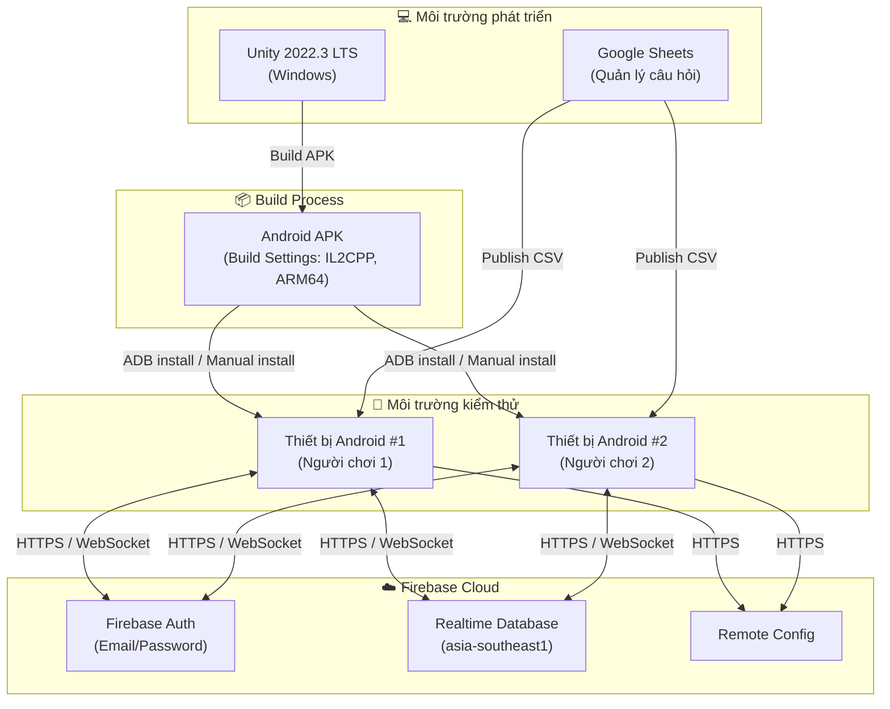

### V.1.2. Cấu hình Firebase

**Firebase Project Settings:**
```
Project ID:     pvp-quizgame
Region:         asia-southeast1 (Singapore)
Auth Methods:   Email/Password
```

**Realtime Database Rules:**
```json
{
  "rules": {
    ".read": "auth != null",
    ".write": "auth != null",
    "matchmakingQueue": {
      "$uid": { ".validate": "$uid === auth.uid" }
    },
    "users": {
      "$uid": { ".write": "$uid === auth.uid" }
    }
  }
}
```

**Remote Config Parameters:**

| Key | Default | Mô tả |
|---|---|---|
| `question_duration` | `15.0` | Thời gian (giây) mỗi câu hỏi |
| `question_count_beginner` | `5` | Số câu cho Tier Beginner (Level 1-5) |
| `question_count_intermediate` | `10` | Số câu cho Tier Intermediate (Level 6-15) |
| `question_count_advanced` | `15` | Số câu cho Tier Advanced (Level 16+) |

### V.1.3. Cấu hình Unity Build

| Tham số | Giá trị |
|---|---|
| Platform | Android |
| Minimum API Level | API 23 (Android 6.0 Marshmallow) |
| Target API Level | API 34 (Android 14) |
| Scripting Backend | IL2CPP |
| Target Architecture | ARM64 |
| Internet Access | Require |
| Write Permission | External (SDCard) |

---

## V.2. Kết quả triển khai

### V.2.1. Các màn hình chính của sản phẩm

*Ghi chú: Ảnh chụp màn hình thực tế từ thiết bị Android được đính kèm trong phụ lục hoặc trình bày trực tiếp khi bảo vệ.*

**Màn hình 1 — InitScene (Khởi động & Đăng nhập):**
- Loading bar tải Localization và Firebase
- Auth Popup với đầy đủ 3 chế độ: Đăng nhập, Đăng ký, Chơi khách

**Màn hình 2 — HomeScene (Sảnh chờ):**
- Profile HUD hiển thị Avatar, Tên, Tiền, Level
- 3 nút chơi rõ ràng; Settings popup đầy đủ chức năng

**Màn hình 3 — Matchmaking (Đang tìm đối thủ):**
- Hoạt ảnh loading; nút Hủy để thoát
- Ghép cặp thành công trong < 3 giây (cùng mạng LAN)

**Màn hình 4 — GameplayScene (Đang chơi):**
- HUD 2 bên cập nhật điểm real-time
- Countdown 3-2-1 trước khi bắt đầu
- Câu hỏi + 4 nút đáp án với feedback màu sắc

**Màn hình 5 — Result Popup (Kết quả):**
- Tiêu đề THẮNG! / THUA! / HÒA! nổi bật
- So sánh điểm 2 bên, hiển thị phần thưởng nhận được
- 2 nút: Chơi Lại và Về Sảnh

### V.2.2. Test Report Summary

| Nhóm kiểm thử | Số TC | Pass | Fail | Tỷ lệ Pass |
|---|:---:|:---:|:---:|:---:|
| Xác thực (Auth) | 4 | 4 | 0 | 100% |
| Matchmaking | 3 | 3 | 0 | 100% |
| Gameplay (câu hỏi, điểm) | 5 | 5 | 0 | 100% |
| Kết thúc trận & Phần thưởng | 3 | 3 | 0 | 100% |
| **Tổng** | **15** | **15** | **0** | **100%** |

### V.2.3. Chỉ số đo lường hoạt động hệ thống

| Chỉ số | Mục tiêu (NFR) | Kết quả đo được |
|---|---|---|
| Độ trễ đồng bộ điểm (Online) | < 200ms | ~80–150ms (cùng khu vực) |
| Framerate trên thiết bị test | 60 FPS | 60 FPS ổn định |
| Thời gian khởi động app (lần đầu) | — | ~3–4 giây |
| Thời gian tìm trận (2 thiết bị cùng mạng) | — | < 3 giây |
| Phát hiện đối thủ ngắt kết nối | ≤ 5 giây | ~3–5 giây |
| Tải Localization (có mạng) | — | ~1–2 giây |
| Tải Localization (offline, dùng cache) | — | < 100ms |

---

*Báo cáo được tổng hợp từ source code thực tế, Game_Flow_Documentation.md và quá trình kiểm thử trên thiết bị Android.*
