# ERD – Hệ thống PvP QuizGame

Tài liệu mô tả mô hình thực thể–quan hệ (ERD) của hệ thống PvP QuizGame.
Do dự án dùng **Firebase Realtime Database (NoSQL, dạng cây JSON)** ở server-side
và **ScriptableObject + PlayerPrefs** ở client-side, ERD dưới đây thể hiện các
"thực thể logic" cùng quan hệ giữa chúng, không phải bảng quan hệ thuần SQL.

---

## 1. Sơ đồ ERD (Mermaid)

```mermaid
erDiagram
    USER ||--o{ MATCHMAKING_ENTRY     : "đứng trong"
    USER ||--o{ ROOM_PLAYER           : "tham gia"
    USER ||--o{ USER_ACHIEVEMENT      : "mở khóa"
    USER ||--o{ USER_POWERUP          : "sở hữu"
    USER ||--o{ DAILY_QUEST_PROGRESS  : "tiến trình"
    USER ||--o{ SEASON_BADGE          : "đạt được"
    USER }o--|| TIER                  : "thuộc"

    ROOM ||--|{ ROOM_PLAYER           : "có"
    ROOM ||--o{ ROOM_ANSWER           : "ghi nhận"
    ROOM ||--o{ ROOM_SCORE            : "theo dõi"
    ROOM }o--|| TIER                  : "phân hạng theo"

    QUIZ_DATABASE ||--|{ QUESTION     : "chứa"
    ROOM }o--o{ QUESTION              : "phát (seed + index)"

    ACHIEVEMENT_DEF ||--o{ USER_ACHIEVEMENT : "định nghĩa cho"
    POWERUP_DEF     ||--o{ USER_POWERUP     : "định nghĩa cho"
    POWERUP_DEF     ||--o{ SHOP_BUNDLE_ITEM : "đóng gói trong"
    SHOP_BUNDLE     ||--|{ SHOP_BUNDLE_ITEM : "bao gồm"
    DAILY_QUEST_DEF ||--o{ DAILY_QUEST_PROGRESS : "ràng buộc"
    SEASON          ||--o{ SEASON_BADGE         : "phát hành"

    LOCALE       ||--o{ LOCALIZED_STRING : "có"
    QUESTION     ||--o{ LOCALIZED_STRING : "được dịch"
    ACHIEVEMENT_DEF ||--o{ LOCALIZED_STRING : "được dịch"
```

---

## 2. Mô tả các thực thể (Entities)

### 2.1 USER (`users/{uid}` trên Firebase)

| Thuộc tính              | Kiểu     | Mô tả                                                  |
|-------------------------|----------|--------------------------------------------------------|
| `uid` (PK)              | string   | Firebase UID (anonymous / email)                       |
| `displayName`           | string   | Tên hiển thị                                           |
| `avatarIndex`           | int      | Chỉ số avatar (0–9)                                    |
| `level`                 | int      | Cấp độ người chơi                                      |
| `currentExp`            | int      | Kinh nghiệm hiện tại                                   |
| `money`                 | int      | Tiền tệ trong game                                     |
| `rankPoints` (FK→TIER)  | int      | Điểm xếp hạng – dùng để tính `currentTier`             |
| `currentTier`           | int      | 1=Bronze, 2=Silver, 3=Gold, 4=Diamond, 5=Legend        |
| `highestTierThisSeason` | int      | Tier cao nhất trong mùa hiện tại                       |
| `lastSeasonProcessed`   | int      | Mùa đã xử lý reset                                     |
| `seasonBadges`          | string   | CSV danh hiệu các mùa trước                            |
| `botWins`               | int      | Số lần thắng bot                                       |
| `totalMoneyEarned`      | int      | Tổng tiền đã kiếm                                      |
| `currentWinStreak`      | int      | Chuỗi thắng hiện tại                                   |
| `highestWinStreak`      | int      | Chuỗi thắng cao nhất                                   |
| `isGuest`               | bool     | Tài khoản khách hay đã đăng ký                         |
| `lastSeen`              | timestamp| ServerValue.Timestamp – lần online cuối                |
| `currentRoom`           | string   | Room đang chơi (dùng cho matchmaking notify)           |

### 2.2 MATCHMAKING_ENTRY (`matchmakingQueue/tier_{n}/{uid}`)

| Thuộc tính | Kiểu     | Mô tả                                |
|------------|----------|--------------------------------------|
| `tier` (PK)| int      | Tier của hàng chờ (1–5)              |
| `uid` (PK,FK→USER) | string | Người chơi đang chờ ghép        |
| `name`     | string   | Tên hiển thị (snapshot)              |
| `avatar`   | int      | Chỉ số avatar (snapshot)             |
| `joinedAt` | timestamp| Dùng để sắp xếp FIFO                 |

Ghi chú: hàng chờ được phân theo tier để ghép đối thủ cùng trình độ.

### 2.3 ROOM (`rooms/{roomId}`)

| Thuộc tính       | Kiểu      | Mô tả                                          |
|------------------|-----------|------------------------------------------------|
| `roomId` (PK)    | string    | "room_xxxxxx" – tạo bởi host                   |
| `createdAt`      | timestamp | Server timestamp                               |
| `seed`           | int       | Hạt giống random để 2 client cùng bộ câu hỏi   |
| `state`          | enum      | `waiting` / `playing` / `ended`                |
| `currentQ`       | int       | Câu hiện tại (host advance)                    |
| `questionCount`  | int       | Số câu/trận theo tier (10/15/20/25/30)         |
| `winner`         | string    | UID người thắng hoặc `"draw"`                  |

### 2.4 ROOM_PLAYER (`rooms/{roomId}/players/{uid}`)

| Thuộc tính | Kiểu   | Mô tả                                         |
|------------|--------|-----------------------------------------------|
| `roomId` (PK,FK→ROOM) | string | Phòng                            |
| `uid` (PK,FK→USER)    | string | Người chơi                       |
| `name`     | string | Tên (snapshot khi vào phòng)                  |
| `avatar`   | int    | Avatar (snapshot)                             |
| `online`   | bool   | Presence (kèm `OnDisconnect → false`)         |

### 2.5 ROOM_ANSWER (`rooms/{roomId}/answers/{uid}`)

| Thuộc tính           | Kiểu | Mô tả                                  |
|----------------------|------|----------------------------------------|
| `roomId,uid` (PK,FK) | -    | Trận + người chơi                      |
| `answerIndex`        | int  | Chỉ số đáp án (0=A … 3=D)              |

Bị xóa mỗi khi host gọi `HostAdvanceQuestion`.

### 2.6 ROOM_SCORE (`rooms/{roomId}/scores/{uid}`)

| Thuộc tính           | Kiểu | Mô tả                       |
|----------------------|------|-----------------------------|
| `roomId,uid` (PK,FK) | -    | Trận + người chơi           |
| `score`              | int  | Điểm tích lũy trong trận    |

### 2.7 QUIZ_DATABASE & QUESTION (ScriptableObject, client-side)

`QuizDatabase`
| Thuộc tính | Kiểu | Mô tả |
|------------|------|------|
| `questions[]` | QuestionData[] | Ngân hàng câu hỏi |

`QuestionData`
| Thuộc tính           | Kiểu     | Mô tả                                         |
|----------------------|----------|-----------------------------------------------|
| `questionId` (PK)    | string   | Asset name                                    |
| `questionText`       | string   | Key Localization hoặc text trực tiếp          |
| `answers[0..3]`      | string[4]| 4 đáp án A/B/C/D                              |
| `correctAnswerIndex` | int      | 0–3                                           |

Quan hệ ROOM↔QUESTION: hai client dùng chung `seed` + `currentQ` để chọn ra
cùng một `QuestionData` từ `QuizDatabase`.

### 2.8 ACHIEVEMENT_DEF / USER_ACHIEVEMENT

`AchievementDef`
| Thuộc tính     | Kiểu   | Mô tả                                  |
|----------------|--------|----------------------------------------|
| `id` (PK)      | string | Mã thành tựu                           |
| `name`         | string | Tên (i18n key)                         |
| `description`  | string | Mô tả (i18n key)                       |
| `targetValue`  | int    | Mục tiêu để hoàn thành                 |
| `rewardAmount` | int    | Tiền thưởng                            |
| `iconClass`    | string | Class USS cho icon                     |
| `iconTint`     | string | Tint icon                              |

`USER_ACHIEVEMENT` lưu trong field `unlockedAchievements` (CSV) của USER:
`USER (uid) ── 1..* ── ACHIEVEMENT_DEF (id)`.

### 2.9 POWERUP_DEF / USER_POWERUP

`POWERUP_DEF` (cố định ở client): `pu_5050`, `pu_time`, `pu_shield`.

`USER_POWERUP` lưu dưới dạng cột riêng trong USER:
`powerUp_5050`, `powerUp_extraTime`, `powerUp_shield` (đều là int).

### 2.10 SHOP_BUNDLE / SHOP_BUNDLE_ITEM

`SHOP_BUNDLE` (định nghĩa trong `ShopManager`)
| Thuộc tính | Kiểu | Mô tả                          |
|------------|------|--------------------------------|
| `bundleId` (PK) | string | Mã gói                    |
| `price`    | int  | Giá tiền                       |

`SHOP_BUNDLE_ITEM`: với mỗi bundle, danh sách `(powerUpId, quantity)`.
Mua bundle → trừ `money` của USER và `AddPowerUp` cho từng item.

### 2.11 DAILY_QUEST_DEF / DAILY_QUEST_PROGRESS

`DAILY_QUEST_DEF` (định nghĩa trong `DailyQuestManager`)
| Thuộc tính | Kiểu | Mô tả                                  |
|------------|------|----------------------------------------|
| `id` (PK)  | string | Mã quest                             |
| `target`   | int  | Số lần cần đạt                         |
| `reward`   | int  | Tiền thưởng                            |

`DAILY_QUEST_PROGRESS` lưu trong `dailyQuestsData` (JSON) của USER:
| Thuộc tính | Kiểu | Mô tả                                       |
|------------|------|---------------------------------------------|
| `date`     | string | yyyy-MM-dd UTC (reset hàng ngày)          |
| `id` (FK→DAILY_QUEST_DEF) | string | Quest                  |
| `progress` | int  | Tiến độ hiện tại                            |
| `claimed`  | bool | Đã nhận thưởng hay chưa                     |

### 2.12 SEASON / SEASON_BADGE / TIER

`SEASON`
| Thuộc tính | Kiểu | Mô tả                          |
|------------|------|--------------------------------|
| `seasonId` (PK) | int | Số mùa                    |
| `startAt`/`endAt` | timestamp | Thời gian mùa         |

`SEASON_BADGE`
| Thuộc tính | Kiểu | Mô tả                                      |
|------------|------|--------------------------------------------|
| `uid` (PK,FK→USER) | string | Người chơi                       |
| `seasonId` (PK,FK→SEASON) | int |                              |
| `badge`    | string | Emoji + nhãn (vd "💎S1")                  |

`TIER` (bảng tra cứu)
| tier | Tên     | Ngưỡng RP   | Số câu/trận |
|------|---------|-------------|-------------|
| 1    | Bronze  | < 500       | 10          |
| 2    | Silver  | 500–1499    | 15          |
| 3    | Gold    | 1500–2999   | 20          |
| 4    | Diamond | 3000–4999   | 25          |
| 5    | Legend  | ≥ 5000      | 30          |

### 2.13 LOCALE / LOCALIZED_STRING (hệ thống Localization)

`LOCALE`
| Thuộc tính | Kiểu | Mô tả                                    |
|------------|------|------------------------------------------|
| `code` (PK)| string | "vi-VN", "en-US", "ja-JP", …          |

`LOCALIZED_STRING`
| Thuộc tính | Kiểu | Mô tả                                        |
|------------|------|----------------------------------------------|
| `key` (PK) | string | Khóa text (ví dụ `question_001`)          |
| `localeCode` (PK,FK→LOCALE) | string |                          |
| `value`    | string | Bản dịch                                   |

Quan hệ: `QUESTION.questionText`, `ACHIEVEMENT_DEF.name/description`,
`DAILY_QUEST_DEF.id`… đều có thể trỏ tới `LOCALIZED_STRING.key` để hệ thống
tự chọn bản dịch theo `LocalizationManager`.

---

## 3. Mối quan hệ chính

1. **USER 1–N MATCHMAKING_ENTRY**: một user chỉ đứng trong đúng 1 queue
   (theo tier hiện tại), nhưng entity là bảng đa giá trị theo tier.
2. **USER N–N ROOM** qua **ROOM_PLAYER**: 1 room luôn có đúng 2 player.
3. **ROOM 1–N ROOM_ANSWER / ROOM_SCORE**: mỗi câu hỏi sinh ra 2 answer
   và liên tục cập nhật 2 score.
4. **QUIZ_DATABASE 1–N QUESTION**: ngân hàng câu hỏi do client nắm,
   server chỉ giữ `seed` để 2 client deterministically chọn cùng câu.
5. **USER N–N ACHIEVEMENT_DEF** qua **USER_ACHIEVEMENT** (CSV).
6. **USER N–N POWERUP_DEF** qua **USER_POWERUP** (cột riêng).
7. **USER N–N DAILY_QUEST_DEF** qua **DAILY_QUEST_PROGRESS** (JSON theo ngày).
8. **USER N–N SEASON** qua **SEASON_BADGE**.
9. **TIER 1–N USER / 1–N MATCHMAKING_ENTRY / 1–N ROOM**: tier điều phối
   matchmaking, độ dài trận, phần thưởng.
10. **LOCALE 1–N LOCALIZED_STRING**: tối ưu hóa nội dung theo từng quốc gia
    (yêu cầu cốt lõi của dự án).

---

## 4. Ghi chú triển khai

- **Firebase Realtime DB** là cây JSON, các "khóa ngoại" như `uid`, `roomId`
  được biểu diễn bằng *path*. Các ràng buộc validation cơ bản
  (`>=0`, `level>=1`…) được đặt trong `firebase_rules_v2.json`.
- **Quyền đọc/ghi** (theo `firebase_rules_v2.json`):
  - `users/$uid`: chỉ chính chủ ghi; mọi user đã auth được đọc (cho leaderboard).
  - `matchmakingQueue/$tier/$uid`: chỉ chính chủ đọc/ghi.
  - `rooms/$roomId`: ai cũng đọc; chỉ user thuộc `players/{uid}` mới được ghi.
- **PlayerData (ScriptableObject)** giữ bản sao local, đồng bộ 2 chiều với
  `users/{uid}` qua `SaveProfileToCloud` / `HandleAuthResult`.
- **Host election**: `IsHost = LocalUserId < OpponentId` (so sánh chuỗi),
  host chịu trách nhiệm `HostAdvanceQuestion` và `HostEndMatch`.
- **Cleanup**: host xóa toàn bộ `rooms/{roomId}` sau 5 giây kể từ khi
  `state="ended"` để cả 2 client kịp đọc kết quả.
