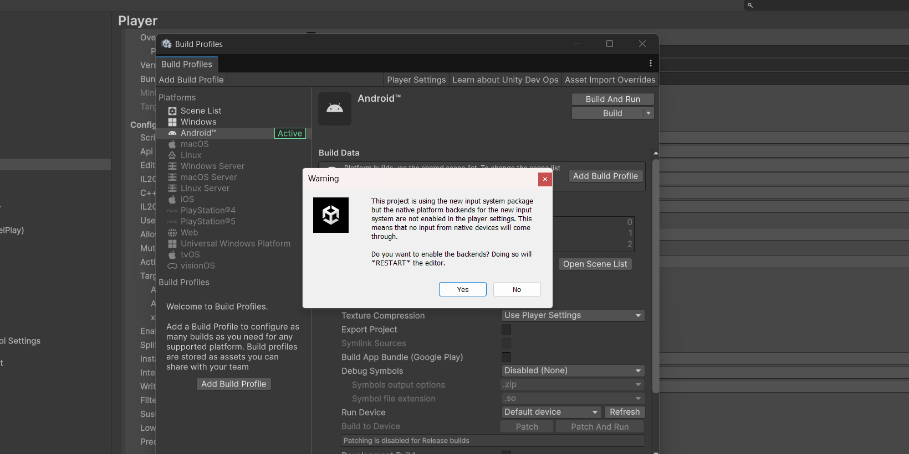

# TÀI LIỆU THAM CHIẾU DỰ ÁN — PvP Quiz Game
> **Phiên bản:** 1.0 | **Cập nhật:** 30/04/2026  
> **Mục đích:** Nguồn tham chiếu duy nhất (Single Source of Truth) phục vụ viết báo cáo môn học. Mọi nội dung bám sát source code thực tế và Game_Flow_Documentation.md.  
> **Lưu ý:** Chức năng Admin Panel đã bị loại bỏ khỏi phiên bản hiện tại.

---

## MỤC LỤC

1. [Tổng quan hệ thống](#1-tổng-quan-hệ-thống)
2. [Công nghệ & Nền tảng](#2-công-nghệ--nền-tảng)
3. [Kiến trúc hệ thống](#3-kiến-trúc-hệ-thống)
4. [Actors & Vai trò](#4-actors--vai-trò)
5. [Danh sách Use Case (cập nhật)](#5-danh-sách-use-case-cập-nhật)
6. [Mô tả luồng hoạt động từng Scene](#6-mô-tả-luồng-hoạt-động-từng-scene)
7. [UC Specification — Các UC quan trọng](#7-uc-specification--các-uc-quan-trọng)
8. [Mô hình dữ liệu](#8-mô-hình-dữ-liệu)
9. [Mô tả các lớp chính (Class Responsibilities)](#9-mô-tả-các-lớp-chính-class-responsibilities)
10. [Hệ thống tính điểm & Phần thưởng](#10-hệ-thống-tính-điểm--phần-thưởng)
11. [Hệ thống Đa ngôn ngữ](#11-hệ-thống-đa-ngôn-ngữ)
12. [Yêu cầu người dùng (FR & NFR)](#12-yêu-cầu-người-dùng-fr--nfr)
13. [Bảng thuật ngữ](#13-bảng-thuật-ngữ)

---

## 1. Tổng quan hệ thống

### 1.1 Mô tả chung

**PvP Quiz Game** là ứng dụng game trả lời câu hỏi (Quiz) trên nền tảng Android, cho phép hai người chơi đối đầu trực tiếp với nhau theo thời gian thực (Real-time Player vs Player). Người chơi đăng nhập, tìm đối thủ qua hệ thống ghép cặp (Matchmaking) tự động, rồi cùng trả lời một bộ câu hỏi được đồng bộ hóa. Người có điểm cao hơn sau tất cả các câu hỏi sẽ giành chiến thắng và nhận phần thưởng.

Ngoài chế độ đấu Online, người chơi có thể chơi Offline với bot AI (Đấu với máy) để luyện tập.

### 1.2 Lý do lựa chọn

| Tiêu chí | Lý do |
|---|---|
| **Tính thực tiễn** | Game quiz PvP là dạng ứng dụng phổ biến, tích hợp đầy đủ các thành phần của một hệ thống phần mềm hoàn chỉnh (Auth, Database, Real-time sync, UI) |
| **Firebase Realtime Database** | Cho phép đồng bộ trạng thái giữa 2 thiết bị với độ trễ < 200ms mà không cần tự dựng server |
| **Unity + UI Toolkit** | Phát triển đa nền tảng, UI Toolkit (UXML/USS) hỗ trợ Flexbox chuẩn web, tái sử dụng tốt |
| **Hệ thống Localization** | Tích hợp đa ngôn ngữ (Tiếng Việt, Tiếng Anh) từ Google Sheets, không cần rebuild ứng dụng để cập nhật nội dung |
| **Phạm vi phù hợp** | Đủ phức tạp để thể hiện kiến trúc phần mềm nhưng có thể hoàn thành trong phạm vi môn học |

### 1.3 Phạm vi hệ thống

**Trong phạm vi (In-scope):**
- Đăng ký / Đăng nhập / Đăng xuất bằng Email & Password
- Chơi khách (Guest) không cần tài khoản, lưu dữ liệu cục bộ
- Tìm trận & ghép cặp tự động (Matchmaking) qua Firebase
- Trận đấu PvP trực tuyến đồng bộ real-time: câu hỏi, điểm số, kết quả
- Trận đấu Offline với AI bot (Đấu với máy)
- Chỉnh sửa hồ sơ: Tên hiển thị, Avatar (8 lựa chọn)
- Hệ thống cấp độ (Level), Kinh nghiệm (EXP), Tiền ảo (Money)
- Cài đặt: Âm thanh (Music/SFX), Đa ngôn ngữ (Tiếng Việt / English)
- Thoát giữa trận với xử phạt (bị xử thua)

**Ngoài phạm vi (Out-of-scope):**
- Bảng xếp hạng toàn cầu (Leaderboard — UI có nhưng chưa triển khai đầy đủ)
- Tính năng Chat trong trận
- Hệ thống bạn bè / lời mời đấu trực tiếp
- Cửa hàng / nạp tiền thật
- Chức năng quản trị câu hỏi (Admin Panel) — **đã bị loại bỏ**

---

## 2. Công nghệ & Nền tảng

### 2.1 Stack kỹ thuật

| Thành phần | Công nghệ | Phiên bản / Ghi chú |
|---|---|---|
| **Game Engine** | Unity | 2022.3 LTS |
| **Ngôn ngữ** | C# | .NET Standard 2.1 |
| **UI Framework** | Unity UI Toolkit (UXML/USS) | Thay thế UGUI truyền thống |
| **Backend** | Firebase Realtime Database | Schema: users, matchmakingQueue, rooms |
| **Xác thực** | Firebase Authentication | Email/Password + Guest (local) |
| **Cấu hình từ xa** | Firebase Remote Config | Thời gian mỗi câu, số câu theo tier |
| **Đa ngôn ngữ** | Google Sheets CSV + JSON local | Fallback 3 cấp độ |
| **Nền tảng** | Android | Min SDK 23 (Android 6.0) |

### 2.2 Thư viện & Package

| Package | Chức năng |
|---|---|
| `Firebase SDK for Unity` | Auth, Realtime DB, Remote Config |
| `Unity Input System` | Xử lý input đa nền tảng |
| `TextMesh Pro` | Render văn bản chất lượng cao |
| `Unity 2D Packages` | Sprite, Animation hỗ trợ giao diện |

---

## 3. Kiến trúc hệ thống

### 3.1 Mẫu kiến trúc áp dụng

Dự án áp dụng **mẫu MVC (Model-View-Controller)** kết hợp với **Singleton Pattern** và **Event-Driven Architecture**:

```
┌─────────────────────────────────────────────────────────┐
│                     VIEW LAYER                          │
│  InitSceneController  │  MainMenuUIController           │
│  GameplayUIController │  InputController_UXML           │
│       (UXML / USS — UI Toolkit)                         │
└─────────────────┬───────────────────────────────────────┘
                  │  C# Events (Action / Delegate)
                  ▼
┌─────────────────────────────────────────────────────────┐
│                   CONTROLLER LAYER                      │
│   GameController   │   TimerController                  │
│   (State Machine: Idle→Countdown→Playing→GameOver)      │
└─────────────────┬───────────────────────────────────────┘
                  │
       ┌──────────┴──────────┐
       ▼                     ▼
┌──────────────┐    ┌────────────────────┐
│  MODEL LAYER │    │   NETWORK LAYER    │
│  QuizManager │    │  FirebaseManager   │
│  ScoreManager│    │  FirebaseMatchProv.│
│  PlayerData  │    │  LocalMatchProvider│
│  PlayerDataMg│    │  (MockOpponent)    │
└──────────────┘    └────────────────────┘
       │                     │
       └──────────┬──────────┘
                  ▼
┌─────────────────────────────────────────────────────────┐
│               INFRASTRUCTURE LAYER                      │
│  LocalizationManager  │  GameManager (Scene routing)    │
│  Firebase Realtime DB │  Google Sheets CSV              │
└─────────────────────────────────────────────────────────┘
```

### 3.2 Luồng sự kiện (Event Flow)

Kiến trúc Event-Driven sử dụng `C# static event (Action / Delegate)` để tách biệt hoàn toàn giữa các lớp, tránh Circular Dependency:

```
FirebaseManager.OnMatchFound        → FirebaseMatchProvider (AttachRoomListeners)
FirebaseMatchProvider.OnBothPlayersAnswered → GameController (RevealAndAdvance)
FirebaseMatchProvider.OnOpponentScoreUpdated → ScoreManager (SetOpponentScore)
ScoreManager.OnScoreChanged         → GameplayUIController (UpdateScoreHUD)
GameController.OnGameStateChanged   → GameplayUIController (ToggleUI panels)
GameController.OnGameOver           → GameplayUIController (ShowResultPopup)
LocalizationManager.OnLanguageChanged → tất cả UIController (RefreshText)
```

### 3.3 Cấu trúc Scene

| Scene | Vai trò |
|---|---|
| **InitScene** | Khởi tạo hệ thống, tải Localization, kết nối Firebase, hiển thị Auth Popup |
| **HomeScene** | Sảnh chờ chính: điều hướng chế độ chơi, hồ sơ người chơi, cài đặt |
| **GameplayScene** | Toàn bộ logic trận đấu: countdown, câu hỏi, tính điểm, kết quả |

### 3.4 Cấu trúc thư mục Scripts

```
Assets/Scripts/
├── Core/
│   ├── GameManager.cs          # Singleton điều hướng Scene, lifecycle app
│   ├── GameController.cs       # State machine trận đấu (Idle/Countdown/Playing/GameOver)
│   ├── QuizManager.cs          # Quản lý bộ câu hỏi, shuffle theo seed
│   ├── ScoreManager.cs         # Tính điểm, phần thưởng, xác định thắng/thua
│   ├── LocalizationManager.cs  # Đa ngôn ngữ (Google Sheet → Cache → JSON local)
│   └── PlayerDataManager.cs    # Hồ sơ người chơi (Level, EXP, Money, Avatar)
├── Network/
│   ├── FirebaseManager.cs      # Auth, Matchmaking, Cloud Save, Remote Config
│   ├── FirebaseMatchProvider.cs # Real-time sync answers & scores trong room
│   ├── LocalMatchProvider.cs   # Điều phối trận offline (không cần Firebase)
│   └── MockOpponent.cs         # AI bot mô phỏng đối thủ offline
├── Controller/
│   ├── InputController_UXML.cs # Nhận input chọn đáp án, hiển thị feedback
│   └── TimerController.cs      # Đếm ngược thời gian mỗi câu
├── UI/
│   ├── InitSceneController_UXML.cs     # UI cho InitScene
│   ├── MainMenuUIController_UXML.cs    # UI cho HomeScene
│   └── GameplayUIController_UXML.cs    # UI cho GameplayScene
└── Data/
    ├── PlayerData.cs           # ScriptableObject: dữ liệu người chơi
    ├── QuestionData.cs         # Model câu hỏi (text, 4 đáp án, đáp án đúng)
    ├── QuizDatabase.cs         # ScriptableObject: danh sách câu hỏi
    └── GoogleSheetDownloader.cs # Tải CSV câu hỏi từ Google Sheets
```

---

## 4. Actors & Vai trò

### 4.1 Người chơi đã đăng nhập (Authenticated Player)

Người dùng đã có tài khoản Firebase (Email/Password). Dữ liệu được đồng bộ lên Cloud.

**Có thể thực hiện:**
- Đăng nhập / Đăng xuất
- Chỉnh sửa hồ sơ (Tên, Avatar)
- Tìm trận đấu PvP Online (Matchmaking)
- Chơi với máy (Offline)
- Xem & nhận phần thưởng sau trận (EXP, Tiền — lưu lên Cloud)
- Đổi ngôn ngữ, cài đặt âm thanh

### 4.2 Người chơi khách (Guest Player)

Người dùng chưa có tài khoản hoặc không muốn đăng nhập. Chỉ nhập tên hiển thị.

**Có thể thực hiện:**
- Chơi với máy (Offline)
- Đổi ngôn ngữ, cài đặt âm thanh
- Phần thưởng sau trận chỉ lưu trong `PlayerPrefs` cục bộ

**Hạn chế:**
- **Không thể** tìm trận đấu PvP Online
- Đăng xuất sẽ **xóa toàn bộ dữ liệu cục bộ** (có cảnh báo)

### 4.3 Hệ thống (System — Firebase)

Đóng vai trò Backend: xử lý xác thực, ghép cặp, đồng bộ dữ liệu phòng đấu.

---

## 5. Danh sách Use Case (cập nhật)

> Chú ý: Các UC liên quan đến Admin Panel (thêm/sửa/xóa/quản lý câu hỏi) đã bị loại bỏ khỏi phạm vi hệ thống.

| Mã UC | Tên Use Case | Actor | Chế độ |
|---|---|---|---|
| UC01 | Đăng ký tài khoản | Guest / Người chơi | — |
| UC02 | Đăng nhập | Người chơi | — |
| UC03 | Đăng xuất | Người chơi / Guest | — |
| UC04 | Chơi khách (Guest Login) | Guest | Offline |
| UC05 | Chỉnh sửa hồ sơ | Người chơi đã đăng nhập | — |
| UC06 | Tìm trận đấu (Matchmaking) | Người chơi đã đăng nhập | Online |
| UC07 | Hủy tìm trận | Người chơi đã đăng nhập | Online |
| UC08 | Bắt đầu trận đấu | Hệ thống (tự động sau ghép cặp) | Online / Offline |
| UC09 | Trả lời câu hỏi | Người chơi | Online / Offline |
| UC10 | Xem điểm đối thủ real-time | Người chơi | Online |
| UC11 | Đầu hàng / Thoát giữa trận | Người chơi | Online / Offline |
| UC12 | Xem kết quả trận đấu | Người chơi | Online / Offline |
| UC13 | Chơi với máy (Practice) | Người chơi / Guest | Offline |
| UC14 | Đổi ngôn ngữ | Người chơi / Guest | — |
| UC15 | Cài đặt âm thanh | Người chơi / Guest | — |
| UC16 | Tính điểm & trao phần thưởng | Hệ thống (tự động) | Online / Offline |

---

## 6. Mô tả luồng hoạt động từng Scene

### 6.1 InitScene — Khởi động & Xác thực

```
Mở App
  └─► [LocalizationManager] Tải CSV từ Google Sheet
        ├─ Có mạng → Tải bản mới nhất → Lưu cache
        ├─ Không mạng → Đọc cache CSV cũ
        └─ Không cache → Dùng JSON local (vi.json / en.json)
  └─► [FirebaseManager] Kiểm tra kết nối & phụ thuộc SDK
  └─► Kiểm tra session đã lưu trên thiết bị?
        ├─ Có (đã đăng nhập trước) → Tải Profile từ Firebase → HomeScene
        └─ Chưa → Hiển thị Auth Popup
              ├─ [Đăng nhập] Nhập Email + Password → Firebase Auth
              │     └─ Thành công → Tải Profile từ Realtime DB → HomeScene
              ├─ [Đăng ký] Nhập Tên + Email + Password → Tạo tài khoản Firebase
              │     └─ Thành công → Khởi tạo bản ghi DB mặc định → HomeScene
              └─ [Chơi khách] Nhập Tên hiển thị → Lưu PlayerPrefs → HomeScene
```

### 6.2 HomeScene — Sảnh chờ

**Profile HUD (góc trên trái):**
- Hiển thị: Avatar, Tên người chơi, Số tiền ($), Cấp độ (Level)
- Bấm vào → Profile Popup: đổi Tên, chọn 1/8 Avatar → Lưu → đồng bộ Firebase

**Điều hướng chính:**
- **TÌM TRẬN ĐẤU** → (chỉ tài khoản đã đăng nhập) → Màn hình "Đang tìm đối thủ..." → Matchmaking → GameplayScene
- **ĐẤU VỚI MÁY** → Tắt Firebase sync → GameplayScene (Offline + AI Bot)
- **BẢNG XẾP HẠNG** → Xem leaderboard (nếu kích hoạt)

**Settings Popup (⚙️ góc trên phải):**
- Tắt/bật Music và SFX
- Đổi ngôn ngữ → tự động refresh toàn bộ chữ trên màn hình
- **Đăng xuất:**
  - Tài khoản Guest → Cảnh báo "Sẽ mất toàn bộ dữ liệu cục bộ" → Xác nhận → Xóa PlayerPrefs → InitScene
  - Tài khoản thường → Đăng xuất Firebase → InitScene

### 6.3 GameplayScene — Trong trận

**Chuẩn bị:**
```
Vào GameplayScene
  └─► GameController.StartGame() → State: Idle → Countdown
  └─► HUD: Avatar + Tên + Điểm (= 0) cho cả P1 (bạn) và P2 (đối thủ)
  └─► Countdown: 3 → 2 → 1 → State: Playing
  └─► Online: Đọc seed & số câu từ Firebase room (đồng bộ 2 client)
      Offline: seed = random theo thời gian, số câu theo Level của người chơi
  └─► QuizManager.StartQuiz(seed, questionCount) → Shuffle câu hỏi theo seed
```

**Vòng lặp câu hỏi:**
```
Hiển thị câu hỏi + 4 đáp án (A/B/C/D) + Bộ đếm ngược
  ├─ Người chơi chọn đáp án → InputController ghi nhận
  │     └─ Nút đổi màu ngay lập tức (xanh = đúng, đỏ = sai)
  │     └─ Online: ghi đáp án lên Firebase room
  │     └─ Điểm tăng: +10 điểm nếu đúng, +0 nếu sai
  │     └─ Online: điểm đối thủ cập nhật real-time qua Firebase listener
  └─ Hết giờ (không chọn) → Coi như chọn sai → Chuyển câu tiếp
```

**Thoát giữa trận:**
```
Bấm ✖ → Exit Confirm Popup "Bạn sẽ bị xử thua"
  ├─ Hủy → Tiếp tục trận
  └─ Xác nhận → ForcedSurrender() → Xử thua P1 → State: GameOver
                └─ Online: Thông báo Firebase → Đối thủ tự động thắng
```

**Kết thúc trận (Result Popup):**
```
Hết câu hỏi → State: GameOver
  └─► Online (Host): Ghi winner vào Firebase room (state = "ended")
  └─► AwardRewards(): cộng EXP + Money dựa theo thắng/thua/hòa
  └─► Online: SaveProfileToCloud() → đẩy level, exp, money lên Firebase
  └─► Hiển thị Result Popup:
        - Tiêu đề: THẮNG! / THUA! / HÒA!
        - So sánh điểm: Bạn X — Đối thủ Y
        - Phần thưởng: +Money +EXP
        - [Chơi Lại] → Thoát phòng → HomeScene → Auto tìm trận mới
        - [Về Sảnh]  → HomeScene
```

---

## 7. UC Specification — Các UC quan trọng

> Format chuẩn: Tên, Mã, Actor, Mô tả, Tiền điều kiện, Luồng chính, Luồng thay thế, Hậu điều kiện.

---

### UC06 — Tìm trận đấu (Matchmaking)

| Trường | Nội dung |
|---|---|
| **Mã UC** | UC06 |
| **Tên** | Tìm trận đấu (Matchmaking) |
| **Actor** | Người chơi đã đăng nhập |
| **Mô tả** | Người chơi kích hoạt tìm đối thủ. Hệ thống tự động ghép cặp qua Firebase và chuyển vào trận khi đủ 2 người. |
| **Tiền điều kiện** | Người chơi đang ở HomeScene, đã xác thực Firebase, có kết nối mạng |
| **Hậu điều kiện (thành công)** | Phòng đấu được tạo trên Firebase, cả 2 người chuyển vào GameplayScene |
| **Hậu điều kiện (thất bại)** | Người chơi ở lại HomeScene, không có phòng nào được tạo |

**Luồng chính:**
1. Người chơi nhấn nút "TÌM TRẬN ĐẤU"
2. Giao diện chuyển sang trạng thái "Đang tìm đối thủ..."
3. `FirebaseManager` ghi UID của người chơi vào node `matchmakingQueue/{uid}`
4. Hệ thống lắng nghe `matchmakingQueue`:
   - Nếu queue rỗng (hoặc chỉ có mình) → Tạo phòng mới trên `rooms/{roomId}`, đặt seed ngẫu nhiên, state = "waiting"
   - Nếu đã có người khác trong queue → Tham gia vào phòng đó, đặt state = "playing"
5. Khi `rooms/{roomId}/players` đủ 2 người: `FirebaseManager.OnMatchFound` được fire
6. Cả 2 client nhận sự kiện `OnMatchFound` → Chuyển sang GameplayScene

**Luồng thay thế:**
- **6a. Người chơi hủy (UC07):** Nhấn "Hủy" → Xóa UID khỏi `matchmakingQueue` → Về HomeScene
- **6b. Mất kết nối:** Firebase timeout → Hiển thị thông báo lỗi → Về HomeScene
- **6c. Đối thủ ngắt kết nối ngay sau ghép:** `OnOpponentDisconnected` được fire → Xử thắng cho người ở lại

---

### UC09 — Trả lời câu hỏi

| Trường | Nội dung |
|---|---|
| **Mã UC** | UC09 |
| **Tên** | Trả lời câu hỏi |
| **Actor** | Người chơi |
| **Mô tả** | Trong trận đấu, người chơi chọn 1 trong 4 đáp án trước khi hết giờ. Hệ thống kiểm tra, hiển thị feedback, cập nhật điểm và chuyển câu tiếp theo. |
| **Tiền điều kiện** | GameState = Playing, có câu hỏi hiện tại, TimerController đang chạy |
| **Hậu điều kiện (thành công)** | Điểm được cập nhật, feedback hiển thị, chuyển câu tiếp hoặc kết thúc trận |
| **Hậu điều kiện (thất bại / hết giờ)** | Không cộng điểm, hiển thị đáp án đúng, chuyển câu tiếp |

**Luồng chính:**
1. Hệ thống hiển thị câu hỏi, 4 nút đáp án (A/B/C/D) và bộ đếm ngược
2. Người chơi chạm vào 1 nút đáp án
3. `InputController_UXML` ghi nhận input, gọi `GameController.SetLocalAnswer(index)`
4. **Online:** `FirebaseMatchProvider` ghi đáp án lên `rooms/{id}/answers/{myUid}`
5. Hệ thống chờ hết giờ (TimerController kết thúc)
6. `TimerController.OnTimerEnd` → `GameController.HandleTimerEnd()`
7. `ScoreManager.CheckAnswer(1, answerIndex)`:
   - Đúng → +10 điểm → `UpdateMyScore()` push lên Firebase (nếu Online)
   - Sai → +0 điểm
8. `InputController_UXML.ShowAnswerFeedback()`: đáp án đúng highlight xanh, sai highlight đỏ, chờ `revealDuration` (2.5 giây)
9. Kiểm tra `HasMoreQuestions()`:
   - Còn câu → `NextQuestion()`, `StartTimer()`, quay lại bước 1
   - Hết câu → `ChangeState(GameOver)`

**Luồng thay thế:**
- **5a. Hết giờ, không chọn đáp án:** `answerIndex = -1` → `CheckAnswer(1, -1)` → Sai → +0 điểm
- **2a. Online — đối thủ ngắt kết nối:** `OnOpponentDisconnected` → `ForcedSurrender` cho P2 → GameOver ngay

---

### UC11 — Đầu hàng / Thoát giữa trận

| Trường | Nội dung |
|---|---|
| **Mã UC** | UC11 |
| **Tên** | Đầu hàng / Thoát giữa trận |
| **Actor** | Người chơi |
| **Mô tả** | Người chơi muốn rời khỏi trận đang diễn ra. Hệ thống cảnh báo hậu quả và xử lý kết quả trận nếu xác nhận. |
| **Tiền điều kiện** | GameState = Playing |
| **Hậu điều kiện (xác nhận)** | P1 thua, P2 thắng; Online → Firebase cập nhật winner; chuyển sang GameOver |
| **Hậu điều kiện (hủy)** | Trận tiếp tục bình thường |

**Luồng chính:**
1. Người chơi nhấn nút ✖ ở góc trên trái
2. Hệ thống mở **Exit Confirm Popup**: *"Bạn có chắc muốn rời đi? Bạn sẽ bị xử thua"*
3. Người chơi nhấn "Xác nhận rời"
4. `GameController.ForcedSurrender()`:
   - `ScoreManager.SetForcedWinner(WinResult.Player2Wins)`
   - `ChangeState(GameOver)`
5. **Online:** `HostEndMatch(winner = OpponentId)` → Cập nhật Firebase
6. Hiển thị Result Popup (THUA!)

**Luồng thay thế:**
- **3a. Người chơi nhấn "Hủy":** Đóng popup, trận tiếp tục
- **4b. Offline:** Bỏ qua bước Firebase, xử lý ngay tại local

---

### UC16 — Tính điểm & Trao phần thưởng

| Trường | Nội dung |
|---|---|
| **Mã UC** | UC16 |
| **Tên** | Tính điểm & Trao phần thưởng |
| **Actor** | Hệ thống (tự động) |
| **Mô tả** | Sau khi trận kết thúc, hệ thống tính kết quả (thắng/thua/hòa), trao EXP và Tiền ảo, nâng cấp Level nếu đủ điều kiện, và lưu dữ liệu. |
| **Tiền điều kiện** | GameState vừa chuyển sang GameOver |
| **Hậu điều kiện** | PlayerData cập nhật EXP, Money, Level; Online → đã push lên Firebase |

**Luồng chính:**
1. `GameController.EndMatchRoutine()` được kích hoạt
2. **Online + Host:** Ghi `winner` vào `rooms/{id}/winner` và `state = "ended"` trên Firebase
3. `ScoreManager.AwardRewards()`:
   - Xác định `WinResult` (P1Wins / P2Wins / Draw)
   - Tính thưởng theo bảng (xem mục 10)
4. `PlayerDataManager.Data.AddExp(expAwarded)` → Kiểm tra nâng Level
5. `PlayerDataManager.Data.AddMoney(moneyAwarded)`
6. `PlayerDataManager.SaveData()` → Lưu vào `PlayerPrefs`
7. **Online:** `FirebaseManager.SaveProfileToCloud()` → Đẩy level, exp, money lên `users/{uid}`
8. `GameController.OnGameOver` event → `GameplayUIController` hiển thị Result Popup

---

### UC08 — Bắt đầu trận đấu

| Trường | Nội dung |
|---|---|
| **Mã UC** | UC08 |
| **Tên** | Bắt đầu trận đấu |
| **Actor** | Hệ thống (tự động sau khi ghép cặp / chọn Đấu với máy) |
| **Mô tả** | Hệ thống khởi tạo trận đấu: đồng bộ seed câu hỏi (Online) hoặc tạo seed ngẫu nhiên (Offline), đếm ngược và bắt đầu vòng lặp câu hỏi. |
| **Tiền điều kiện** | Đã vào GameplayScene; Online: đã có `CurrentRoomId` hợp lệ |
| **Hậu điều kiện** | GameState = Playing, câu hỏi đầu tiên được hiển thị |

**Luồng chính:**
1. `GameController.Start()` xác định mode (Online/Offline)
2. `ChangeState(Countdown)` → Hiển thị 3 → 2 → 1
3. `ChangeState(Playing)`:
   - **Online:** Đọc `seed` và `questionCount` từ `rooms/{id}` (đồng bộ 2 client dùng chung seed)
   - **Offline:** `seed` = random từ `DateTime.UtcNow.Ticks`; `questionCount` tính theo tier Level người chơi
4. `QuizManager.StartQuiz(seed, questionCount)` → Shuffle và load câu hỏi
5. `TimerController.StartTimer()` → Bắt đầu đếm ngược câu đầu tiên
6. Hiển thị câu hỏi số 1

---

## 8. Mô hình dữ liệu

### 8.1 Firebase Realtime Database Schema

```json
{
  "users": {
    "<uid>": {
      "displayName": "ChienK20",
      "level": 5,
      "currentExp": 120,
      "money": 1250,
      "lastSeen": 1746012345,
      "avatarIndex": 2
    }
  },

  "matchmakingQueue": {
    "<uid>": {
      "displayName": "ChienK20",
      "joinedAt": 1746012345
    }
  },

  "rooms": {
    "<roomId>": {
      "createdAt": 1746012345,
      "seed": 481923572,
      "questionCount": 10,
      "state": "waiting | playing | ended",
      "players": {
        "<uidP1>": { "name": "ChienK20", "ready": true },
        "<uidP2>": { "name": "Mai99",    "ready": true }
      },
      "currentQ": 0,
      "answers": {
        "<uidP1>": 2,
        "<uidP2>": 0
      },
      "scores": {
        "<uidP1>": 30,
        "<uidP2>": 20
      },
      "winner": "<uidP1> | draw | null"
    }
  }
}
```

### 8.2 Firebase Security Rules

```json
{
  "rules": {
    ".read": "auth != null",
    ".write": "auth != null",
    "matchmakingQueue": {
      "$uid": { ".validate": "$uid === auth.uid" }
    },
    "users": {
      "$uid": { ".write": "$uid === auth.uid" }
    }
  }
}
```

### 8.3 PlayerData (Local — ScriptableObject)

| Trường | Kiểu | Mô tả |
|---|---|---|
| `playerName` | string | Tên hiển thị người chơi |
| `level` | int | Cấp độ hiện tại (min: 1) |
| `currentExp` | int | Điểm kinh nghiệm trong level hiện tại |
| `money` | int | Tiền ảo tích lũy |
| `avatarIndex` | int | Chỉ số avatar (0–7) |

**Lưu trữ:** `PlayerPrefs` (cục bộ) + Firebase `users/{uid}` (cloud, chỉ với tài khoản đăng nhập)

### 8.4 QuestionData (Model)

| Trường | Kiểu | Mô tả |
|---|---|---|
| `questionText` | string | Nội dung câu hỏi |
| `answers[]` | string[4] | 4 đáp án (A, B, C, D) |
| `correctAnswerIndex` | int | Chỉ số đáp án đúng (0–3) |
| `category` | string | Danh mục câu hỏi |

---

## 9. Mô tả các lớp chính (Class Responsibilities)

| Lớp | Pattern | Trách nhiệm chính |
|---|---|---|
| `GameManager` | Singleton | Điều hướng Scene, lifecycle ứng dụng, framerate, sleep timeout |
| `GameController` | Singleton + State Machine | Điều phối toàn bộ trận đấu. State: Idle → Countdown → Playing → GameOver |
| `QuizManager` | Singleton | Load, shuffle (theo seed), cấp phát câu hỏi theo thứ tự |
| `ScoreManager` | Singleton | Tính điểm P1 & P2, xác định thắng/thua/hòa, trao phần thưởng |
| `TimerController` | MonoBehaviour | Đếm ngược thời gian mỗi câu, fire `OnTimerEnd` khi hết giờ |
| `InputController_UXML` | MonoBehaviour | Nhận input chọn đáp án từ UI, hiển thị feedback màu sắc |
| `FirebaseManager` | Singleton | Auth (Email/Password), Matchmaking, Cloud Save, Remote Config |
| `FirebaseMatchProvider` | Singleton | Listener real-time: đáp án, điểm, state phòng — chỉ hoạt động Online |
| `LocalMatchProvider` | Singleton | Điều phối trận Offline: mô phỏng luồng "cả 2 đã trả lời" |
| `MockOpponent` | MonoBehaviour | AI bot: chọn đáp án ngẫu nhiên sau delay ngẫu nhiên |
| `LocalizationManager` | Singleton | Tải ngôn ngữ (Sheet → Cache → JSON), expose `GetText(key)` |
| `PlayerDataManager` | Singleton | CRUD PlayerData: Load/Save (PlayerPrefs), Cloud sync qua FirebaseManager |

---

## 10. Hệ thống tính điểm & Phần thưởng

### 10.1 Điểm trong trận

| Kết quả trả lời | Điểm nhận |
|---|---|
| Đúng | +10 điểm |
| Sai | +0 điểm |
| Hết giờ (không chọn) | +0 điểm |

> **Lưu ý:** Phiên bản hiện tại không áp dụng bonus điểm theo tốc độ trả lời (thiết kế đơn giản hóa). Điểm mỗi câu cố định là 10.

### 10.2 Phần thưởng sau trận

| Kết quả | EXP nhận | Tiền ảo nhận |
|---|---|---|
| **Thắng** | +50 EXP | +100 $ |
| **Hòa** | +20 EXP | +40 $ |
| **Thua** | +10 EXP | +10 $ |

### 10.3 Hệ thống cấp độ (Level-up)

Sau mỗi trận, `PlayerData.AddExp()` kiểm tra và tự động nâng Level nếu đủ EXP. Ngưỡng EXP tăng dần theo Level.

### 10.4 Số câu hỏi theo Tier (Offline)

Số câu hỏi trong trận Offline phụ thuộc vào Level người chơi (lấy từ Firebase Remote Config):

| Tier | Level người chơi | Số câu |
|---|---|---|
| Beginner | 1–5 | 5 câu |
| Intermediate | 6–15 | 10 câu |
| Advanced | 16+ | 15 câu |

**Online:** Số câu và seed được đồng bộ từ Firebase room (cả 2 client dùng chung).

---

## 11. Hệ thống Đa ngôn ngữ

### 11.1 Cơ chế hoạt động

`LocalizationManager` tải nội dung ngôn ngữ theo thứ tự ưu tiên:

1. **Google Sheet CSV** (nếu có `sheetUrl` và kết nối mạng, timeout 6 giây)
2. **Cache CSV** đã tải về trước, lưu tại `Application.persistentDataPath`
3. **JSON local** trong `StreamingAssets` (`vi.json`, `en.json`)

### 11.2 Cấu trúc dữ liệu ngôn ngữ

Câu hỏi quiz được đóng gói trong hệ thống Localization theo quy ước key:

```
q_<category>_<index>     → Nội dung câu hỏi
a_<category>_<index>_1   → Đáp án 1 (LUÔN là đáp án ĐÚNG)
a_<category>_<index>_2   → Đáp án 2
a_<category>_<index>_3   → Đáp án 3
a_<category>_<index>_4   → Đáp án 4
```

Ví dụ:
```json
{ "key": "q_it_001",     "value": "CPU là viết tắt của từ gì?" },
{ "key": "a_it_001_1",   "value": "Central Processing Unit" },
{ "key": "a_it_001_2",   "value": "Computer Personal Unit" }
```

### 11.3 Ngôn ngữ hỗ trợ

| Mã | Ngôn ngữ | File local |
|---|---|---|
| `vi` | Tiếng Việt (mặc định) | `vi.json` |
| `en` | Tiếng Anh | `en.json` |

Khi đổi ngôn ngữ, `LocalizationManager.OnLanguageChanged` được fire → toàn bộ UIController tự refresh text.

---

## 12. Yêu cầu người dùng (FR & NFR)

### 12.1 Yêu cầu chức năng (Functional Requirements)

| Mã | Yêu cầu | UC liên quan | Ưu tiên |
|---|---|---|---|
| FR-01 | Hệ thống cho phép người dùng đăng ký tài khoản bằng Email và Mật khẩu | UC01 | Must |
| FR-02 | Hệ thống cho phép đăng nhập bằng Email/Password qua Firebase Auth | UC02 | Must |
| FR-03 | Hệ thống cho phép đăng xuất và xóa session | UC03 | Must |
| FR-04 | Người dùng có thể chơi không cần tài khoản (chế độ khách) | UC04 | Must |
| FR-05 | Người chơi có thể thay đổi Tên hiển thị và Avatar (1/8 lựa chọn) | UC05 | Should |
| FR-06 | Hệ thống tự động ghép cặp 2 người chơi qua Firebase Matchmaking | UC06 | Must |
| FR-07 | Người chơi có thể hủy tìm trận bất kỳ lúc nào | UC07 | Must |
| FR-08 | Hệ thống đồng bộ seed câu hỏi cho cả 2 client để đảm bảo cùng bộ câu | UC08 | Must |
| FR-09 | Người chơi trả lời câu hỏi trong thời gian quy định; hết giờ coi như sai | UC09 | Must |
| FR-10 | Điểm của đối thủ được cập nhật real-time trên HUD (< 200ms) | UC10 | Must |
| FR-11 | Người chơi có thể thoát giữa trận và bị xử thua; đối thủ tự động thắng | UC11 | Must |
| FR-12 | Hệ thống hiển thị kết quả trận (Thắng/Thua/Hòa) và điểm so sánh | UC12 | Must |
| FR-13 | Người chơi có thể đấu với AI bot (chế độ luyện tập, không cần mạng) | UC13 | Must |
| FR-14 | Người dùng có thể đổi ngôn ngữ giao diện (Tiếng Việt / English) | UC14 | Must |
| FR-15 | Người dùng có thể bật/tắt âm nhạc nền và hiệu ứng âm thanh | UC15 | Should |
| FR-16 | Hệ thống tự động trao EXP, Tiền ảo và cập nhật Level sau mỗi trận | UC16 | Must |
| FR-17 | Dữ liệu người chơi (Level, EXP, Money) được đồng bộ lên Firebase Cloud sau trận | UC16 | Must |
| FR-18 | Hệ thống tải câu hỏi đa ngôn ngữ từ Google Sheets; fallback sang cache/local nếu offline | — | Should |

### 12.2 Yêu cầu phi chức năng (Non-Functional Requirements)

| Mã | Loại | Yêu cầu |
|---|---|---|
| NFR-01 | **Hiệu năng** | Đồng bộ điểm và trạng thái giữa 2 thiết bị trong < 200ms (Firebase Realtime DB) |
| NFR-02 | **Hiệu năng** | Ứng dụng duy trì 60 FPS trên thiết bị Android tầm trung (API 23+) |
| NFR-03 | **Độ tin cậy** | Nếu đối thủ mất kết nối, hệ thống phát hiện trong ≤ 5 giây và xử lý thắng/thua tự động |
| NFR-04 | **Độ tin cậy** | Hệ thống Localization có fallback 3 cấp (Sheet → Cache → Local JSON) đảm bảo không crash khi offline |
| NFR-05 | **Bảo mật** | Mật khẩu người dùng được mã hóa bởi Firebase Authentication, không lưu plain-text |
| NFR-06 | **Bảo mật** | Firebase Security Rules đảm bảo người dùng chỉ ghi vào node của chính mình |
| NFR-07 | **Khả dụng** | Giao diện hỗ trợ cả màn hình ngang và dọc (UI Toolkit Flexbox) |
| NFR-08 | **Khả năng bảo trì** | Kiến trúc Event-Driven (C# Action/Delegate) tách biệt UI và Logic, không tạo Circular Dependency |
| NFR-09 | **Khả năng mở rộng** | Bộ câu hỏi được cập nhật qua Google Sheets mà không cần rebuild ứng dụng |
| NFR-10 | **Tính nhất quán** | Cả 2 client trong cùng phòng luôn dùng chung seed → cùng bộ câu hỏi, cùng thứ tự |

---

## 13. Bảng thuật ngữ

| Thuật ngữ | Định nghĩa |
|---|---|
| **PvP (Player vs Player)** | Chế độ chơi trong đó 2 người thật đấu với nhau trực tiếp, phân biệt với PvE (Player vs Environment/AI) |
| **Matchmaking** | Thuật toán tự động ghép cặp 2 người chơi có yêu cầu tìm trận vào cùng một phòng đấu |
| **Room (Phòng đấu)** | Node dữ liệu trên Firebase Realtime Database chứa toàn bộ thông tin của một trận đấu đang diễn ra |
| **Seed** | Giá trị số nguyên dùng để khởi tạo bộ sinh số ngẫu nhiên (RNG). Hai client dùng chung seed sẽ cho ra cùng thứ tự câu hỏi sau khi shuffle |
| **Host** | Một trong 2 người chơi được chỉ định làm chủ phòng (UID nhỏ hơn). Host có quyền ghi kết quả cuối trận lên Firebase |
| **Firebase Authentication** | Dịch vụ xác thực của Google Firebase hỗ trợ Email/Password, Anonymous, OAuth v.v. |
| **Firebase Realtime Database** | Cơ sở dữ liệu NoSQL dạng JSON của Firebase, đồng bộ dữ liệu real-time tới tất cả client đang lắng nghe |
| **Firebase Remote Config** | Dịch vụ Firebase cho phép thay đổi tham số cấu hình ứng dụng (thời gian đếm ngược, số câu hỏi) mà không cần cập nhật app |
| **UI Toolkit (UXML/USS)** | Framework xây dựng giao diện của Unity dựa trên chuẩn XML/CSS, thay thế UGUI truyền thống |
| **Localization** | Quá trình điều chỉnh nội dung ứng dụng (văn bản, hình ảnh) phù hợp với ngôn ngữ và văn hóa của từng vùng địa lý |
| **PlayerPrefs** | API của Unity để lưu trữ dữ liệu đơn giản (key-value) trên thiết bị cục bộ |
| **Singleton** | Mẫu thiết kế đảm bảo một lớp chỉ có duy nhất một thể hiện (instance) trong toàn bộ ứng dụng |
| **Event-Driven Architecture** | Kiến trúc phần mềm trong đó các thành phần giao tiếp thông qua sự kiện (event) thay vì gọi trực tiếp, giảm sự phụ thuộc giữa các module |
| **State Machine** | Mô hình hành vi trong đó đối tượng có thể ở một trong nhiều trạng thái xác định (Idle, Countdown, Playing, GameOver) và chuyển đổi theo quy tắc |
| **ScriptableObject** | Kiểu asset của Unity dùng để lưu trữ dữ liệu độc lập với Scene (PlayerData, QuizDatabase) |
| **EXP (Experience Points)** | Điểm kinh nghiệm tích lũy sau mỗi trận, dùng để tăng cấp độ (Level) người chơi |
| **WinResult** | Enum trong hệ thống: `Player1Wins`, `Player2Wins`, `Draw` — kết quả trận đấu |
| **ForcedSurrender** | Cơ chế xử thua cưỡng bức khi người chơi chủ động thoát giữa trận hoặc mất kết nối |
| **RevealDuration** | Thời gian (2.5 giây) hiển thị feedback đúng/sai sau khi hết giờ, trước khi chuyển sang câu tiếp |
| **Tier** | Nhóm phân loại Level người chơi (Beginner/Intermediate/Advanced) dùng để xác định số câu hỏi trong trận Offline |
