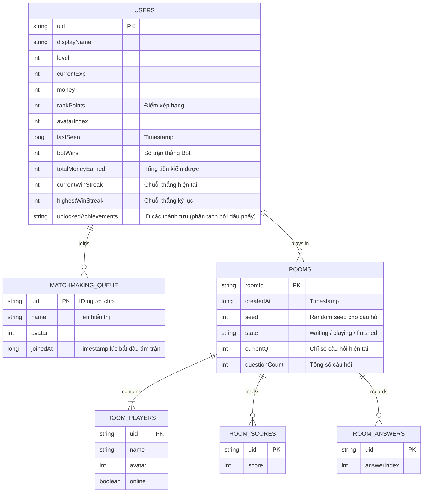

# Sơ đồ Cơ sở dữ liệu (ERD) - PvP Quiz Game

Dưới đây là sơ đồ thực thể liên kết (ERD) mô tả cấu trúc của Firebase Realtime Database sau khi đã cập nhật hệ thống Thành tựu và Xếp hạng ở Phase 1.

## Giải thích các cập nhật mới (Phase 1)
- **rankPoints**: Được thêm vào `USERS` để theo dõi điểm số phục vụ cho Bảng xếp hạng.
- **Achievement Stats**: Các trường `botWins`, `totalMoneyEarned`, `currentWinStreak`, `highestWinStreak` và `unlockedAchievements` được thêm vào `USERS` để hệ thống `AchievementManager` có thể theo dõi và cấp phần thưởng tự động khi người chơi hoàn thành nhiệm vụ.
